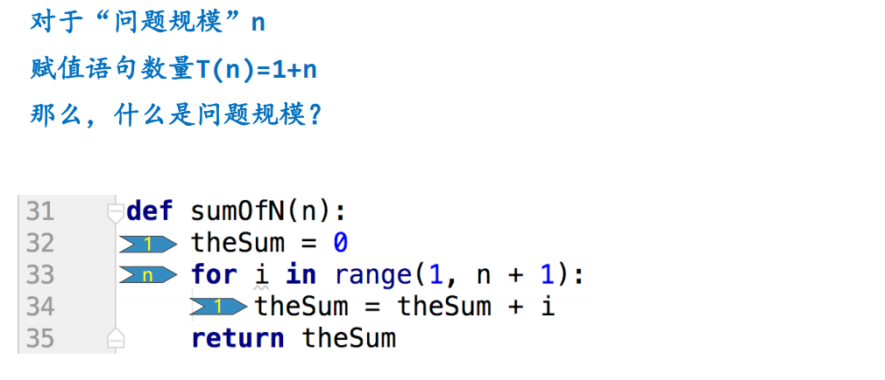

# 大O表示法

## 算法时间度量指标
### 一个算法所实施的**操作数量或者步骤数量**可以作为独立于具体程序/机器的度量指标  
我们需要一种通用的基本操作来作为运行步骤的计量单位
### 赋值语句是一个好的选择  
因为赋值语句同时包括了**计算**（表达式）和**存储**（变量）这两个基本资源。  
除了与计算资源无关的定义语句之外，主要就是三种控制流语句和赋值语句，控制流语句只起了组织语句的作用，并不实施处理。

## 赋值语句执行次数

## 问题规模影响算法执行时间
### 问题规模：影响算法执行时间的主要因素
### 在计算前n个整数的累加和的时候，需要累计的整数个数适合作为问题规模的指标
### 算法分析的目的是要找出问题规模会怎么影响一个算法的执行时间

## 数量级函数 Order of Magnitude
### 在进行算法分析时，T(n)的精确值并不是特别重要，而重要的是T(n)中其决定因素的主导部分
也就是当问题规模增大时，对增长贡献最大的部分
### 数量级函数描述了T(n)中随着n增加而增加速度最快的主导部分  
称作“大O”表示法，记作O(f(n))，其中f(n)表示T(n)中的主导部分