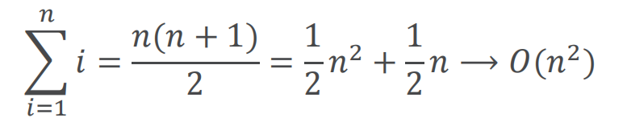

# “变位词”判断问题（上）

## 解法1：逐字检查
解题思路：将s1中的字符逐个到s2中检查是否存在，如果存在，就打钩标记（防止重复检查），如果每个字符都能找到，则两个词是变位词

问题规模：词中包含的字符个数n

主要问题在于两重循环：  
外层循环遍历s1每个字符，将内层循环执行n次，而每个内层循环在s2中查找字符，每个字符的比较次数，分别是1、2...n中的一个，而且各不相同

所以总执行次数是：1+2+3+……+n

可知其数量级为O(n^2)

## 解法2：排序比较
解题思路：将两个字符串都按照字母顺序排好序再逐个字符对比是否相同，如果相同则是变位词有任何不同就不是变位词

粗看上去，本算法只有一个循环，最多执行n次，数量级是O(n)

但是循环前面的两个排序可不是没有代价的，通过后面的章节，可以知道，其运行时间差不多是O(n^2)或者O(nlogn)的，其实是大于循环的O(n)

所以本算法的时间主导的步骤其实是**排序**步骤

本算法的运行时间数量级就**等于排序过程的数量级O(n log n)**

## 解法3：暴力法
穷尽所有组合，将s1中出现的字符进行全排列，再查看s2是否在全排列列表中

问题在于，n个字符进行全排列，其所有可能得组合有n!个。

n!的增长速度甚至超过了2^n。

## 解法4：计数比较
解题思路： 对比两个词中每个字母出现的次数，如果26个字母出现的次数都相同的话，这两个字符串就一定是变位词

计数比较算法中，存在三个循环迭代，但是不像解法1那样存在嵌套循环。

前两个循环用于对字符串进行计数，操作次数等于字符串长度n  
第3个循环用于计数器比较，操作次数总是26次

所以总操作次数`T(n)=2n+26`，其数量级为`O(n)`  
这是一个线性数量级的算法，是4个变位词判断算法中性能最优的

但是，他其实依赖两个长度为26的计数器列表，来保存字符计数，相比其他三种算法，它需要更多的存储空间。

这种在时间和空间之间进行取舍的过程经常在算法中出现，时间换空间/空间换时间。

