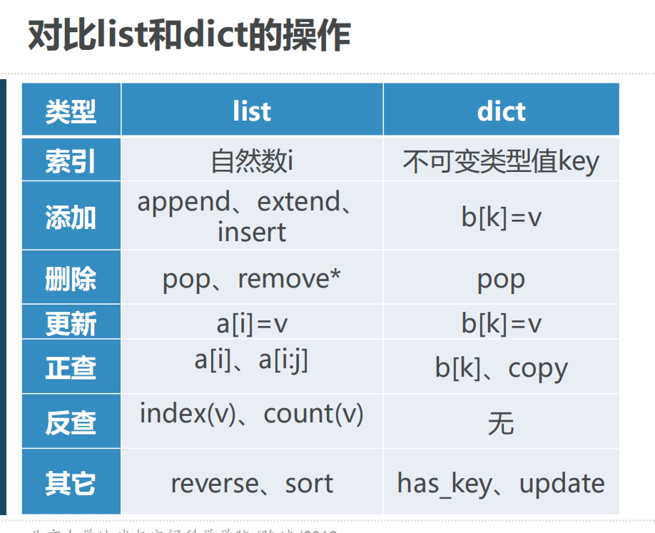
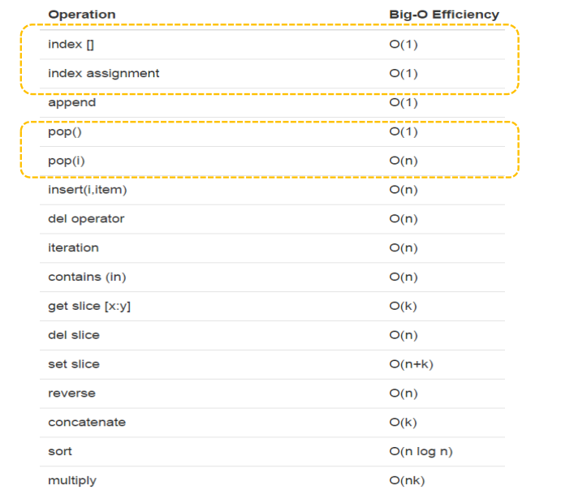

# Python数据类型的性能（上）


## List列表数据类型
对于List的各种操作，可以有很多种实现方法。  
总的方案就是，让**最常用**的操作**性能最好**，牺牲不太常用的操作。

## List列表数据类型常用操作性能

最常用的是：按索引取值以及赋值（v=a[i]，a[i]=v）  
由于列表的随机访问的特性，这两个操作的执行时间与列表大小无关，都是`O(1)`

另一个是列表增长，可以使用`append()`和`__add__`（也就是`+`）  
`list.append()`，执行时间是`O(1)`
`list = list + [v]`,执行时间是`O(n+k)`,其中k是被加的列表长度（因为这个操作会复制原来的列表，并生成一个新列表，所以n是原来列表的长度，k是要附加的列表的长度）

## 4种生成前n个整数列表的方法
```python
from timeit import Timer
# 4种生成前n个整数列表的方法
# 循环连接列表
def test1():
    l = []
    for i in range(10000):
        l = l + [i]


# append
def test2():
    l = []
    for i in range(10000):
        l.append(i)


# 列表推导式
def test3():
    l = [i for i in range(10000)]

# range函数转成列表
def test4():
    l = list(range(10000))

if __name__ == '__main__':
    t1 = Timer("test1()", "from __main__ import test1")
    print(f"concat {t1.timeit(number=100)} seconds\n")

    t2 = Timer("test2()", "from __main__ import test2")
    print(f"concat {t2.timeit(number=100)} seconds\n")

    t3 = Timer("test3()", "from __main__ import test3")
    print(f"concat {t3.timeit(number=100)} seconds\n")

    t4 = Timer("test4()", "from __main__ import test4")
    print(f"concat {t4.timeit(number=100)} seconds\n")
```

## 4种生成前n个整数列表的方法计时
列表连接（concat）最慢，List range最快，速度相差近200倍。  
append也要比concat快得多  
另外，我们注意到列表推导式速度是append两倍的样子

## List基本操作的大O数量级

