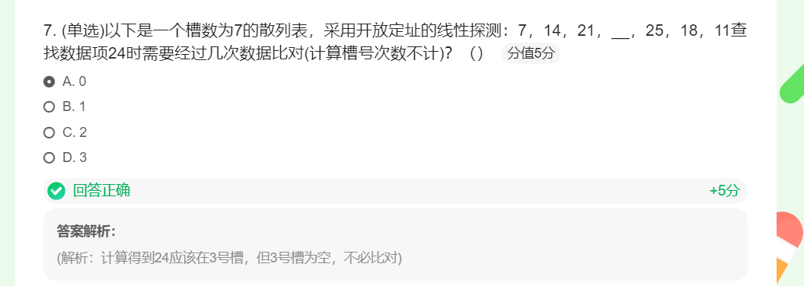

+ 散列查找的事件复杂度在O(1)
+ 散列存储一般需要比顺序存储使用更多存储空间，这主要有几个原因： 
  + 哈希冲突： 在使用哈希表时，不同的键可能会映射到相同的哈希值，即发生哈希冲突。为了解决这个问题，通常需要使用额外的数据结构，比如链表、二叉树或者其他解决冲突的方法（比如开放寻址法）。这些额外的数据结构会增加存储空间的需求。 
  + 装载因子： 哈希表有一个装载因子的概念，它表示已存储的元素数量与哈希表大小的比值。为了避免哈希冲突频繁发生，需要保持合理的装载因子，这可能会导致需要动态调整哈希表的大小，从而增加了额外的空间开销。 
  + 哈希函数和存储结构： 为了实现一个良好的哈希函数，需要投入额外的资源和算法来确保哈希函数的高效性和均匀性。此外，哈希表的内部结构和管理也需要一定的开销，如维护哈希表的元信息、链表或树结构等。
+ Python中的字典数据类型是散列的一种应用

+ 解决散列冲突的一种方法就是为冲突的数据项**再找一个**开放的空槽来保存
    + 最简单的就是从冲突的槽开始往后扫描，直到碰到一个空槽
    + 如果到散列表尾部还未找到，则从首部接着扫描
+ 这种**寻找空槽**的技术称为“**开放地址** open addressing”
+ 向后**逐个槽寻找**的方法则是开放地址技术中的“**线性探测** liner probing”

+ 如果采用线性探测的开放地址法来解决冲突（λ在0~1之间）
  + 成功的查找，平均需要比对次数为：1/2*(1+1/(1-λ))
  + 不成功的查找，平均比对次数为：1/2*(1+(1/(1-λ))^2)
+ 如果采用数据链来解决冲突（λ可以大于1）
  + 成功的查找，平均需要比对次数为：1+λ/2 
  + 不成功的查找，平均比对次数为：λ