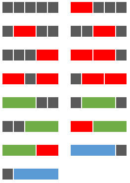

## 1:铺瓷砖
总时间限制: 500ms 内存限制: 65536kB
## 描述
### 题目内容：

给定一个长度为N的区域，及4种不同长度的瓷砖：灰瓷砖（长为1格）、红瓷砖（长为2格）、绿瓷砖（长为3格）与蓝瓷砖（长为4格），求所有不同的铺满整个区域的方法数。

例如：当N=5时，共有15种铺满区域的方法，示意图如下：




### 输入
一个非负整数N
### 输出
一行数字，表示不同的方法总数
### 样例输入
```python
5
0
```
### 样例输出
```python
15
1
```
