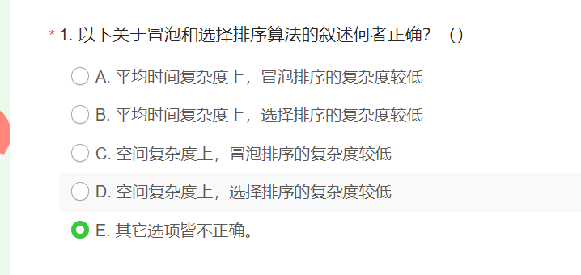
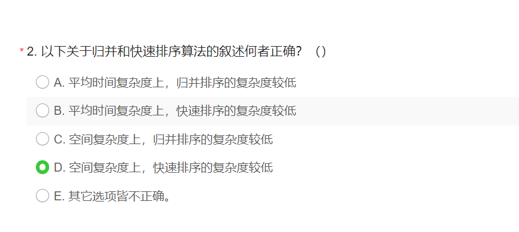
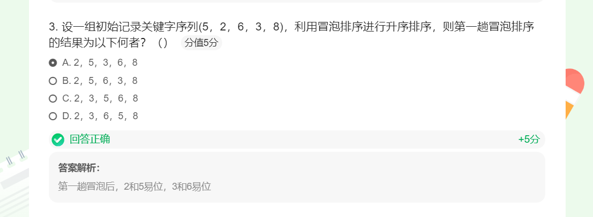
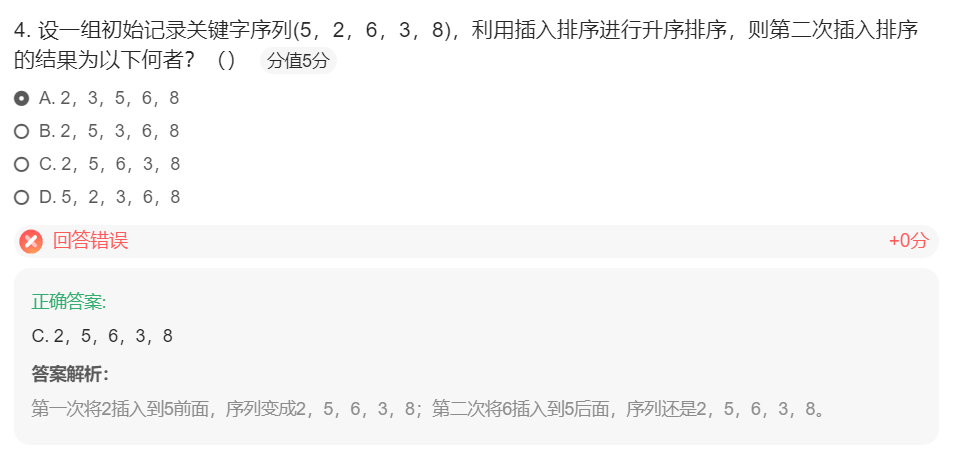
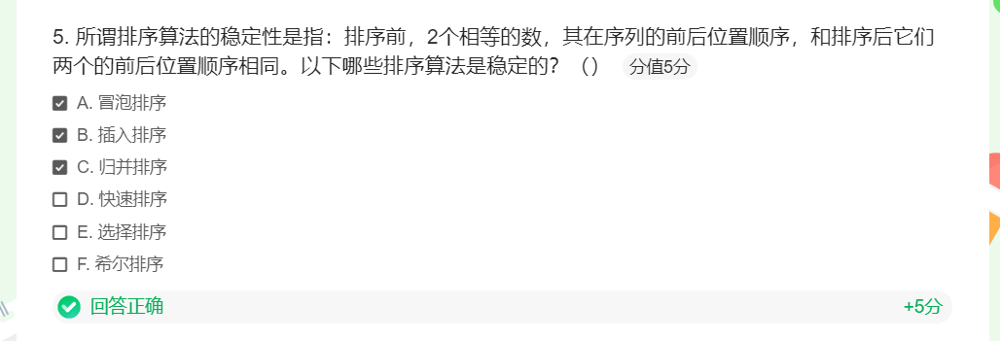
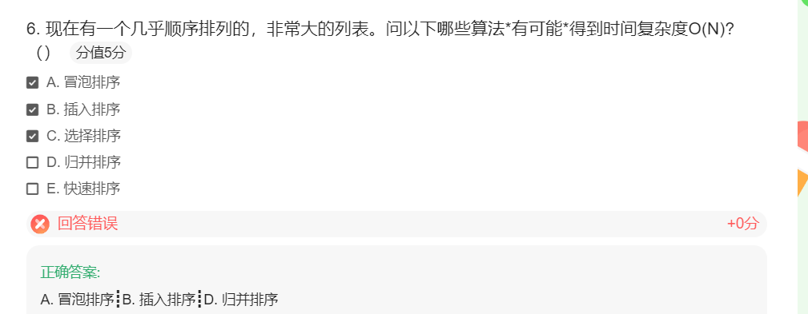
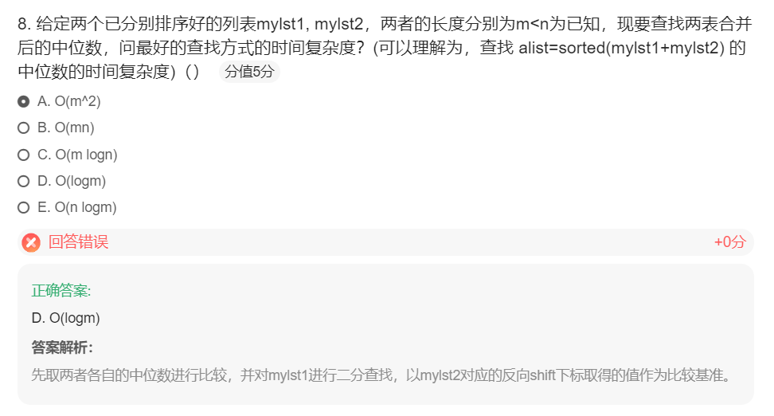

+ 冒泡排序
  + 算法过程总共需要n-1趟，随着趟数的增加，**比对**次数逐步从n-1减小到1，并包括可能发生的数据项**交换**
    + 比对次数是：1~n-1的累加：(n-1)*n/2=1/2*n^2-1/2n
    + 对比的时间复杂度**O(n^2)**
    + 
    + 关于交换次数，时间复杂度也是O(n^2)，通常每次交换包括3次赋值操作
      + **最好**情况下，列表已经有序，交换次数为0
      + **最差**情况下，每次比对都要交换，交换次数等于比对次数
      + **平均**情况下，是最差情况的一半
    * 所以，综合起来，冒泡排序算法的
      * 时间复杂度：O(n^2)
      * 空间复杂度：O(1)

+ 选择排序
  + 选择排序的时间复杂度比起冒泡排序稍优
    + 对比次数不变，还是O(n^2)
    + 交换次数则减少为O(n)
  + 所以，选择排序的
    * 时间复杂度：O(n^2)
    * 空间复杂度：O(1)
+ 冒泡排序和选择排序
  + 时间复杂度相同：O(n^2)
  + 空间复杂度相同：都无需额外的空间，所以其空间复杂度为O(1)

+ 归并排序
  + 时间复杂度
    + 将归并排序分为两个过程来分析：**分裂** 和 **归并**
    + 分裂的过程，借鉴二分查找中的分析结果，是对数复杂度，时间复杂度为O(logn)
    + 归并的过程，相对于分裂的每个部分，其所有数据项都会被比较和放置一次，所以是线性复杂度，其时间复杂度是O(n)
      + 综合考虑，每次分裂的部分都进行一次O(n)的数据归并，总的时间复杂度是O(n*logn)
  + 空间复杂度
    + 在合并操作中，需要创建一个临时数组来存储两个有序子数组的合并结果。临时数组的长度与待排序数组的长度相同，因此合并操作的空间复杂度为O(n)。
+ 快速排序
  + 时间复杂度
    + 如果分裂**总能**把数据表分为**相等**的**两部分**，那么就是O(logn)的复杂度
    + 而移动需要将每项与中值进行比对，还是O(n)
    + 综合起来就是O(n*logn)
    + 但是，如果不那么幸运的话，中值所在的分裂点过于偏离中部，造成左右两部分数量不平衡
    + 极端情况，有一部分始终没有数据，这样，时间复杂度就会退化到O(n^2)
  + 空间复杂度
    + 在算法运行中不需要额外的存储空间，所以空间复杂度是O(1)

+ 冒泡排序的过程
  + 冒泡排序的算法思路在于对无序表进行多趟比较交换
  + 每趟包括了多次两两相邻比较，并将逆序的数据项互换位置，最终能将本趟的最大项就位
  + 经过n-1趟比较交换，实现整表排序

+ 插入排序的过程
  + 插入排序维持一个已排好序的子列表，其位置始终在列表的前部，然后逐步扩大这个子列表直到全表
  + 第1趟，子列表仅包含第一个数据项，将第2个数据项作为“新项”插入到子列表的合适位置中，这样已排序的子列表就包含了2个数据项
  + 第2趟，再将第3个数据项跟前2个数据项进行比对，并移动比自身大的数据项，空出位置来，以便加入到子列表中
  + 经过n-1趟比对和插入，子列表扩展到全表，排序完成

+ **稳定性的定义：**  
  排序前后，两个相等的数，相对位置不变，则算法稳定
+ **算法稳定的好处**  
  从一个键上排序，然后再从另一个键上排序，第一个键排序的结果可以作为第二个键排序所用
+ **各排序算法的稳定性**
  + 不稳定：堆排序、快速排序、希尔排序、直接选择排序
  + 稳定：基数排序、冒泡排序、直接插入排序、折半插入排序、归并排序
+ **冒泡排序（稳定）**
  1. 小的元素往前调或者把大的往后调
  2. 比较是相邻两个元素比较，交换也发生在这两个元素之间
+ **选择排序（不稳定）**
  1. 每个位置选择当前元素最小的
  2. 在每一趟选择中，如果当前元素比某一个元素小，而该小的元素又出现在和当前元素相等的元素后面，那么交换后的稳定性就被破坏了。
  3. 举个例子，假设有一个数组 [5, 5, 3]，经过选择排序后，可能会得到 [3, 5, 5]。原本相对顺序是按照索引的顺序排列的两个相同元素，在排序后它们的相对顺序发生了改变。
+ **插入排序（稳定）**
  1. 在已经有序的小序列的基础上，一次插入一个元素
  2. 想要插入的元素和已经有序的最大者比起，如果比它大则插入到其后面，否则一直往前找到它应该插入的位置
  3. 如果碰见一个和插入元素相等的，那么就把要插入的元素放在相等元素的后面
  4. 相等元素的前后顺序没有改变
+ **快速排序（不稳定）**
  1. 分区过程：快速排序通过选择一个基准元素，将待排序序列分割成两个子序列，并将小于基准元素的放在左边，大于基准元素的放在右边。在这个分区过程中，相等元素的相对顺序可能发生改变。例如，考虑序列[5, 3, 2, 5, 1]，以元素5为基准进行分区，第一次分区后可能得到[3, 2, 1, 5, 5]，原本相等的两个5的相对顺序发生了改变。
  2. 递归排序：快速排序使用递归的方式对子序列进行排序。在递归的过程中，对于相等的元素，可能会进行交换操作，从而导致它们的相对顺序发生变化。这是因为快速排序不关心相等元素的顺序，只关注将元素分割到正确的子序列中。
+ **归并排序（稳定）**
  1. 把序列递归地分为短序列，递归结束条件是序列只有一个元素（直接认为有序）或者两个序列（1次比较和交换），然后把各个有序的短序列合并成一个有序的长序列，不断合并直到序列全部排好序
  2. 合并过程中我们可以保证如果两个当前元素相等时，我们把处在前面的序列的元素保存在结果序列的前面，这样就保证了稳定性；
+ **希尔排序（不稳定）**
  1. 按照不同步长对元素进行插入排序
  2. 当刚开始元素很无序的时候，步长最大，所以插入排序的元素个数很少，速度很快；
  3. 当元素基本有序了，步长很小， 插入排序对于有序的序列效率很高；
  4. 所以，希尔排序的时间复杂度会比o(n^2)好一些
  5. 由于多次插入排序，我们知道一次插入排序是稳定的，不会改变相同元 素的相对顺序，但在不同的插入排序过程中，相同的元素可能在各自的插入排序中移动，最后其稳定性就会被打乱；
+ **基数排序（稳定）**
  1. 按照低位先排序，然后收集；再按照高位排序，然后再收集；依次类推，直到最高位
  2. 用于整数；
  3. 需要较多的存储空间；
  4. 基于分别排序，分别收集
+ **堆排序（不稳定）**
  1. 是选择排序的一种；
  2. 堆的结构是节点i的孩子为2*i和2*i+1节点，大顶堆要求父节点大于等于其2个子节点，小顶堆要求父节点小于等于其2个子节点，是完全二叉树；
  3. 在一个长为n 的序列，堆排序的过程是从第n/2开始和其子节点共3个值选择最大(大顶堆)或者最小(小顶堆),这3个元素之间的选择当然不会破坏稳定性。但当为n /2-1, n/2-2, …1这些个父节点选择元素时，就会破坏稳定性。有可能第n/2个父节点交换把后面一个元素交换过去了，而第n/2-1个父节点把后面一个相同的元素没 有交换，那么这2个相同的元素之间的稳定性就被破坏了；

+ **A：冒泡排序**，两两元素进行比较，若逆序则交换，如果某次循环发现没有交换，则表示列表已经有序。所以当列表几乎顺序排列时，只需要比对n-1次，发现并未出现逆序，直接可认为列表有序。
+ **B：插入排序**，插入排序每次都是与已经有序的子列表的最大项开始比较，如果列表已经接近有序，那么每次比较后，直接插入到末尾即可，只需要n-1次
+ C：选择排序，选择排序即使在列表几乎有序的时候，也需要从前n个元素开始挨个遍历，找出最大的，所以比较次数是O(n^2)
+ **D: 归并排序**，排序过程中可检测，如果前段序列的最大值小于等于后段序列最小值，则说明序列可直接形成一段有序序列，不需要再进行归并操作
+ E：快读排序，快速排序的比较次数有O(n*logn)

  