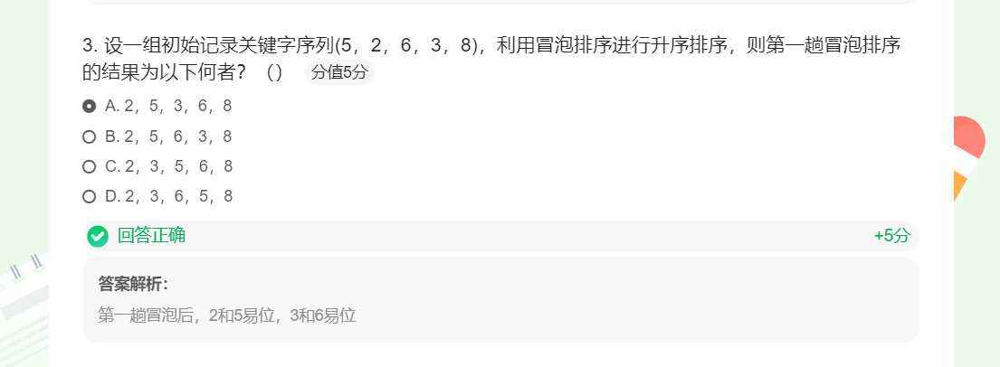
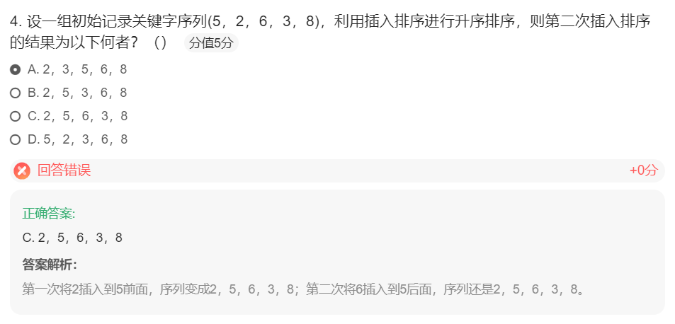
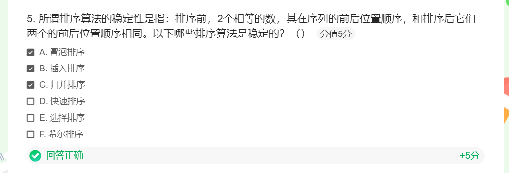

+ 冒泡排序
  + 算法过程总共需要n-1趟，随着趟数的增加，**比对**次数逐步从n-1减小到1，并包括可能发生的数据项**交换**
    + 比对次数是：1~n-1的累加：(n-1)*n/2=1/2*n^2-1/2n
    + 对比的时间复杂度**O(n^2)**
    + 
    + 关于交换次数，时间复杂度也是O(n^2)，通常每次交换包括3次赋值操作
      + **最好**情况下，列表已经有序，交换次数为0
      + **最差**情况下，每次比对都要交换，交换次数等于比对次数
      + **平均**情况下，是最差情况的一半
    * 所以，综合起来，冒泡排序算法的
      * 时间复杂度：O(n^2)
      * 空间复杂度：O(1)

+ 选择排序
  + 选择排序的时间复杂度比起冒泡排序稍优
    + 对比次数不变，还是O(n^2)
    + 交换次数则减少为O(n)
  + 所以，选择排序的
    * 时间复杂度：O(n^2)
    * 空间复杂度：O(1)
+ 冒泡排序和选择排序
  + 时间复杂度相同：O(n^2)
  + 空间复杂度相同：都无需额外的空间，所以其空间复杂度为O(1)

+ 归并排序
  + 时间复杂度
    + 将归并排序分为两个过程来分析：**分裂** 和 **归并**
    + 分裂的过程，借鉴二分查找中的分析结果，是对数复杂度，时间复杂度为O(logn)
    + 归并的过程，相对于分裂的每个部分，其所有数据项都会被比较和放置一次，所以是线性复杂度，其时间复杂度是O(n)
      + 综合考虑，每次分裂的部分都进行一次O(n)的数据归并，总的时间复杂度是O(n*logn)
  + 空间复杂度
    + 在合并操作中，需要创建一个临时数组来存储两个有序子数组的合并结果。临时数组的长度与待排序数组的长度相同，因此合并操作的空间复杂度为O(n)。
+ 快速排序
  + 时间复杂度
    + 如果分裂**总能**把数据表分为**相等**的**两部分**，那么就是O(logn)的复杂度
    + 而移动需要将每项与中值进行比对，还是O(n)
    + 综合起来就是O(n*logn)
    + 但是，如果不那么幸运的话，中值所在的分裂点过于偏离中部，造成左右两部分数量不平衡
    + 极端情况，有一部分始终没有数据，这样，时间复杂度就会退化到O(n^2)
  + 空间复杂度
    + 在算法运行中不需要额外的存储空间，所以空间复杂度是O(1)

+ 冒泡排序的过程
  + 冒泡排序的算法思路在于对无序表进行多趟比较交换
  + 每趟包括了多次两两相邻比较，并将逆序的数据项互换位置，最终能将本趟的最大项就位
  + 经过n-1趟比较交换，实现整表排序

+ 插入排序的过程
  + 插入排序维持一个已排好序的子列表，其位置始终在列表的前部，然后逐步扩大这个子列表直到全表
  + 第1趟，子列表仅包含第一个数据项，将第2个数据项作为“新项”插入到子列表的合适位置中，这样已排序的子列表就包含了2个数据项
  + 第2趟，再将第3个数据项跟前2个数据项进行比对，并移动比自身大的数据项，空出位置来，以便加入到子列表中
  + 经过n-1趟比对和插入，子列表扩展到全表，排序完成

+ **稳定性的定义：**  
  排序前后，两个相等的数，相对位置不变，则算法稳定
+ **算法稳定的好处**  
  从一个键上排序，然后再从另一个键上排序，第一个键排序的结果可以作为第二个键排序所用
+ **各排序算法的稳定性**
  + 不稳定：堆排序、快速排序、希尔排序、直接选择排序
  + 稳定：基数排序、冒泡排序、直接插入排序、折半插入排序、归并排序
+ **冒泡排序（稳定）**
  1. 小的元素往前调或者把大的往后调
  2. 比较是相邻两个元素比较，交换也发生在这两个元素之间
+ **选择排序（不稳定）**
  1. 每个位置选择当前元素最小的
  2. 在每一趟选择中，如果当前元素比某一个元素小，而该小的元素又出现在和当前元素相等的元素后面，那么交换后的稳定性就被破坏了。
  3. 举个例子，假设有一个数组 [5, 5, 3]，经过选择排序后，可能会得到 [3, 5, 5]。原本相对顺序是按照索引的顺序排列的两个相同元素，在排序后它们的相对顺序发生了改变。