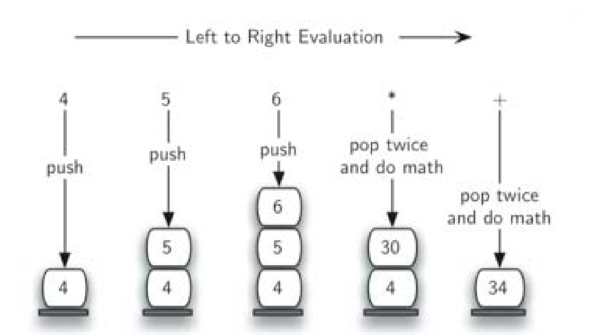

## 后缀表达式求值

对后缀表达式进行扫描  
由于操作符在两个操作数的后面，所以需要临时将操作数暂存起来  
碰到操作符时，将最近的两个操作数弹出并进行实际的计算  
> 操作符只作用于最近的两个操作数

**在弹出操作数的时候，要注意弹出操作数的顺序，先弹出的是第二操作数，然后才是第一操作数。**  
这对于减法`-`和除法`/`来说特别重要。  
比如：`53-`，`3`先出栈，然后才是`5`

继续扫描后面的符号  
当所有操作符都处理完毕，栈顶唯一的元素就是表达式结果。

## 后缀表达式求值：流程
+ 创建空栈operandStack来暂存操作数
+ 将后缀表达式用split方法转换成token列表
+ 从左到右扫描列表
+ 碰到操作数，将其转换为int，入栈
+ 碰到操作符，开始求值，先pop出来的是右操作数，之后是左操作数，求值后将中间结果压回栈中。
+ token列表扫描完成后，结果就在栈顶
+ 返回栈顶元素值

