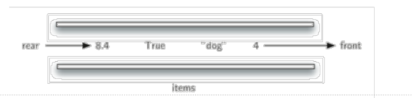
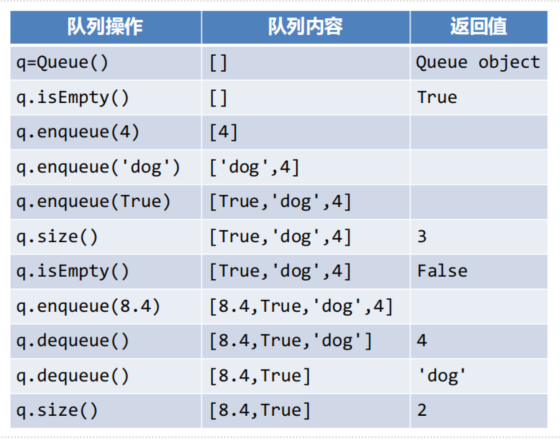

## 队列Queue：什么是队列？
队列是一种有次序的数据集合，其特征是：
+ 新数据项的添加总是发生在一端（通常称为“尾端”rear端）
+ 而现存数据项的移除总发生在另一端（通常为“首端”front端）

当数据项加入队列，首先会出现在队尾，随着队首数据项的移除，它逐渐接近队首。

新加入的数据项必须在数据集末尾等待，而等待时间最长的数据项则是队首（因为它是最早进来的，一开始排在队尾，熬了半天终于到了队首）

这种次序安排的原则称为（FIFO：First-in-first-out）

队列仅有一个入口和一个出口：  
不允许数据项直接插入队中，也不允许从中间移除数据项

## 抽象数据类型Queue
抽象数据类型Queue由如下操作定义：
+ Queue():创建一个空队列对象，返回值为Queue对象
+ enqueue(item):将数据项item添加到队尾，无返回值
+ dequeue():从队首移除数据项，返回值为队首数据项，队列被修改
+ isEmpty():测试是否为空队列，返回值为布尔值
+ size():返回队列中数据项的个数

