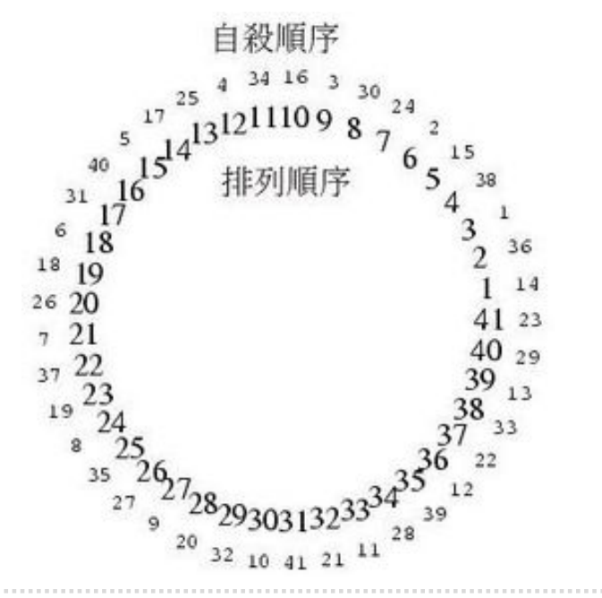

# 热土豆问题（约瑟夫问题）
类似于击鼓传花  
传递烫手的土豆，鼓声停止，拿着的小朋友出列  
如果忽略鼓的存在，每次传递固定的次数，就成了现代版的约瑟夫问题。

传说犹太人反叛罗马人，落到困境，约瑟夫和39人决定殉难，坐成一圈儿，报数1～7，
报到7的人由旁边杀死，结果约瑟夫给自己安排了个位置，最后活了下来……

## 热土豆问题：算法
用队列来解决热土豆问题，传入参加游戏的人员列表，以及每次传土豆的此处num，
最终返回剩下的人名

模拟程序使用队列来存储参与游戏的人名，按照土豆传递方向从队首到队尾  
游戏开始时，队首始终都是持有土豆的人

模拟游戏开始时，只需要将队首出队再入队到队尾，就完成了一次土豆的传递  
传递了num次后，将队首的人移除，不再入队，直到队列中仅剩一人

