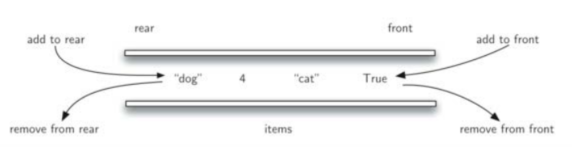
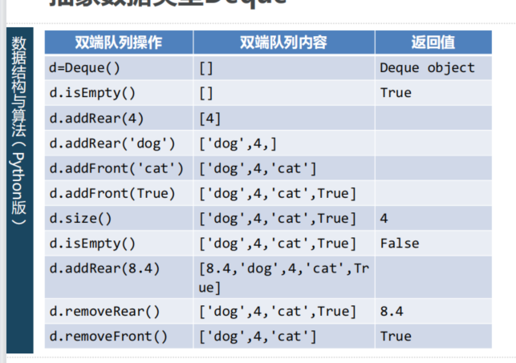
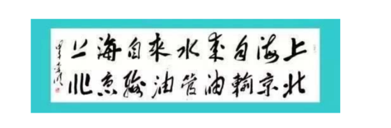

# 双端队列抽象数据类型及Python实现
## 双端队列Deque：什么是Deque？
### 双端队列Deque是一种有次序的数据集
跟队列相似，其两端可以成为“首”尾“两端，但是在deque中数据项既可以从队首加入，也可以从队尾加入。
同理，也可以从两端移除。  

某种意义上说，双端队列集成了栈和队列的能力


### 但双端队列不具备内在的LIFO或者FIFO特性
如果用双端队列来模拟栈或者队列，需要由使用者自行维护操作的一致性

## 抽象数据类型Deque
### deque定义的操作如下：
+ Deque():创建一个空双端队列
+ addFront(item):从队首添加一个item
+ addRear(item):从队尾添加一个item
+ removeFront():从队首移除一个数据项，返回值为移除的数据项
+ removeRear():从队尾移除一个数据项，返回值为移除的数据项
+ isEmpty():返回deque是否为空
+ size():返回deque中包含数据项的个数



## Python实现ADT Deque
### 采用List实现
List下标0作为deque的尾端  

List下标-1作为deque的首端
### 操作复杂度
add_front/remove_front:O(1)

add_rear/remove_rear:O(n)
```python
class Deque:
    def __init__(self):
        self.items = []

    def add_front(self, item):
        self.items.append(item)

    def add_rear(self, item):
        self.items.insert(0, item)

    def remove_front(self):
        return self.items.pop()

    def remove_rear(self):
        return self.items.pop(0)

    def isEmpty(self):
        return self.items == []

    def size(self):
        return len(self.items)
```
## 回文词判定
### 回文词指的是：正读和反读都一样的词
如：radar、madam、toot

中文：上海自来水来自海上 山东落花生花落东山


### 使用双端队列很容易解决“回文词”判断的问题
首先将需要判定的词从队尾加入deque

再从两端同时移除字符，判断是否相同，直到deque中剩下0或1个字符

## 回文词判断：代码

```python
from DSA22.pythonds.basic.deque import Deque


def palchecker(a_str):
    str_queue = Deque()
    for s in a_str:
        str_queue.addRear(s)

    still_ok = True
    while str_queue.size() > 1 and still_ok:
        first = str_queue.removeFront()
        last = str_queue.removeRear()
        if first != last:
            still_ok = False

    return still_ok


if __name__ == '__main__':
    print(palchecker("北京输油管油输京北"))
    print(palchecker("safasdfadf"))

```