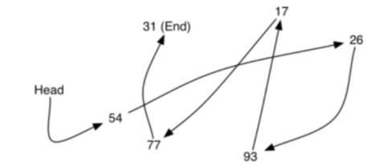
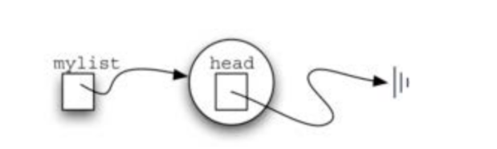
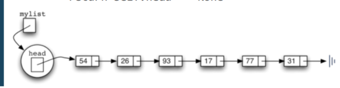

# 无序表抽象数据类型及Python实现
## 列表List：什么是列表？
### 在前面的基本数据结构讨论中，我们采用PythonList来实现了多种线性数据结构
### 列表List是一种简单强大的数据集结构，提供了丰富的操作接口
但并不是所有的编程语言都提供了List数据类型，有实话需要程序员自己实现

### 一种数据项按**相对位置**存放的数据集
特别的，被称为无序表（unordered list）

其中数据项只按照存放位置来索引，如第1个、第2个等  
（为了简单起见，假设表中不存在重复数据项）

### 如一个考试分数的集合“54, 26, 93, 17,77和31”
### 如果用无序表来表示，就是[54, 26, 93, 17, 77, 31]

## 抽象数据类型：无序表List
### 无序表List的操作如下：
+ List():创建一个空列表
+ add(item):添加一个数据项到列表中，假设item原先不存在在列表中
+ remove(item)：从列表中移除item，列表被修改，item原先应存在于表中
+ search(item)：在列表中查找item，返回布尔类型值
+ isEmpty()：返回列表是否为空
+ size()：返回列表包含了多少数据项
+ append(item)：添加一个数据项到表末尾，假设item原先不存在于列表中
+ index(item)：返回数据项在表中的位置
+ insert(pos, item)：将数据项插入到位置pos，假设item原先不存在与列表中，同时原列表具有足够多个数据项，能让item占据位置pos
+ pop()：从列表末尾移除数据项，假设原列表至少有1个数据项
+ pop(pos)：移除位置为pos的数据项，假设原列表存在位置pos

## 采用链表存放无序表
### 为了实现无序表数据结构，可以采用链接表的方案
### 虽然列表数据要求保持数据项的前后相对位置，但是并不表示数据项要依次存放在连续的存储空间
### 如下图，数据项存放位置并没有规则，但是如果在数据项之间建立链接指向，就可以保持其前后相对位置
第一个和最后一个数据项需要显式标记出来，一个是队首，一个是队尾，后面再无数据了。


## 链表实现：节点Node
```python
class Node:
    def __init__(self, init_data):
        self.data = init_data
        self.next = None

    def get_data(self):
        return self.data

    def get_next(self):
        return self.next

    def set_data(self, new_data):
        self.data = new_data

    def set_next(self, new_next):
        self.next = new_next
```

## 链表实现：无序表UnorderedList
### 可以采用链接节点的方式构建数据集来实现无序表
### 链表的第一个和最后一个节点最重要
如果想访问到链表中的所有节点，那就必须从第一个节点开始沿着链接遍历下去


### 所以无序表必须要有对第一个节点的引用信息
设立一个属性head，保存对第一个节点的引用  

空表的head为None
```python
class UnorderedList:
    def __init__(self):
        self.head = None
```
### 随着数据项的插入，无序表的head始终指向链表中的第一个节点
注意！无序表mylist对象本身并不包含数据项（数据项在节点中）

其中包含的head只是对首个节点Node的引用

判断空表的isEmpty()方法很容易实现
```python
return self.haed == None
```
