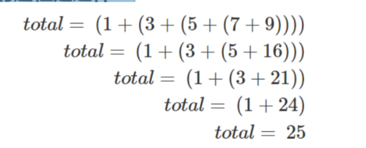
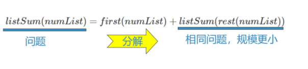
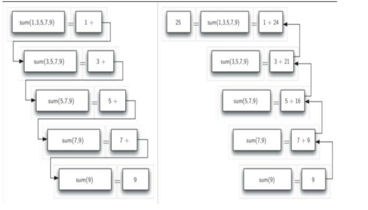

# 什么是递归
## 什么是递归Recursion
### 递归是一种解决问题的方法，其精髓在于：
将问题分解为更小规模的**相同问题**

持续分解，直到问题规模小到可以用**非常简单直接**的方式解决

递归的问题分解方式非常独特，其算法的明显特征就是：在算法流程中**调用自身**

### 递归为我们提供了一种对复杂问题的优雅解决方案，精妙的递归算法会出奇简单，令人惊叹。

## 初识递归：数列求和
### 问题，给定一个列表，返回所有数的和
列表中元素的个数不定，需要一个循环和一个累加变量来迭代求和
### 程序很简单，但是假设没有循环语句
既不能用for，也不能用while

还能对**不确定长度**的列表求和么
```python
def list_sum(num_list):
    sum = 0
    for i in num_list:
        sum += i
    return sum
```
### 我们认识到，求和实际上最终是由一次次的加法来实现的，而加法恰巧有两个操作数，这个是确定的
### 看看怎么想办法，将问题规模较大的列表求和，分解为规模较小而且固定的两个数求和
同样是求和问题，但规模发生了变化，符合递归解决问题的特征
### 换个方式来表达数列求和：全括号表达式
`(1+(3+(5+(7+9))))`
### 上面的式子，最内层的括号`(7+9)`是无需循环就能计算的，实际上整个求和的过程是这样的：

### 观察上述过程中所包含的重复模式，可以把求和问题归纳成这样：
数列的和=“第一个数”+“余下数列”的和
### 如果余下的数列少到只有一个数的时候，它的和就是这个数字了
这就是规模小到可以做最简单的处理  

### 上面的递归算法变成程序
```python
def list_sum_recursion(num_list):
    if len(num_list) == 1:
        return num_list[0]
    else:
        return num_list[0] + list_sum_recursion(num_list[1:])

print(list_sum_recursion([1, 2, 4, 5, 6, 3]))
```
### 上面程序的要点：
1. 问题分解为**更小规模**的相同问题，并表现为**调用自身**
2. 对**最小规模**问题的解决：简单直接
## 递归程序如何执行？
### 递归函数调用和返回过程的链条

## 递归“三定律”
### 为了向阿西莫夫的“机器人三定律”致敬，递归算法也总结出“三定律”
1. 递归算法必须有一个基本结束条件（最小规模的问题直接解决）
2. 递归算法必须能够改变状态向基本结束条件演进（减小问题规模）
3. 递归函数必须调用自身（解决减小了规模的相同问题）
## 递归三定律：数列求和问题
### 数列求和问题首先具备了**基本结束条件**：当列表长度为1的时候，直接输出所包含的唯一数
### 数列求和的数据处理对象是一个列表，而基本结束条件就是长度为1的列表，而递归算法就是要改变列表并向长度为1的方向演进
我们看到具体的做法就是将列表的长度减1
### 调用自身是递归算法中最难理解的部分，实际上我们理解为“问题分解成了规模更小的相同问题“就可以了
在数列求和算法中，就是“更短数列的求和问题”