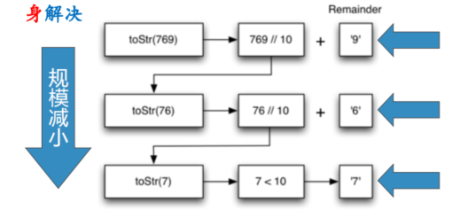

# 递归的应用：任意进制转换
## 整数转换为任意进制
### 之前我们在数据结构栈里面讨论过的算法，现在又回来了
可见，递归和栈，一定有关联

### 我们用最熟悉的十进制分析这个问题
十进制有十个不同的符号：`convString="0123456789"`  
比10小的整数，转换成十进制，直接查表就可以：`convString[n]`  
想办法把比10大的整数，拆成一系列比10晓得整数，逐个查表  
比如七百六十九，拆成七、六、九，查表得到769就可以了
### 所以，在递归三定律中，我们找到了“基本结束条件”，就是小于10的整数
拆解整数的过程，就是向“基本结束条件”演进的过程
### 我们用整数除，和求余数两个计算来将整数一步步拆开
除以“进制基base”（//base）  
对“进制基”求余数（% base）
### 问题就分解为：
余数总小于“进制基base”，是“基本结束条件”，可以直接查表转换  
整数商，成为“更小规模”的问题，通过递归调用自身来解决  


### 递归算法的代码
```python

```