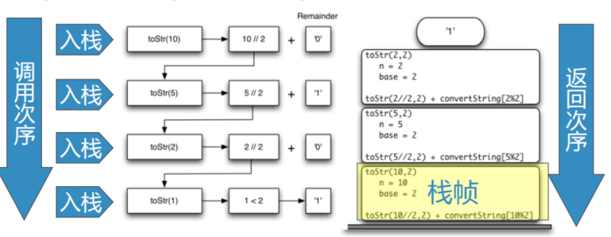
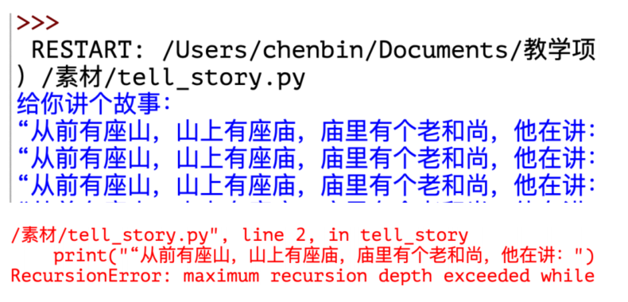
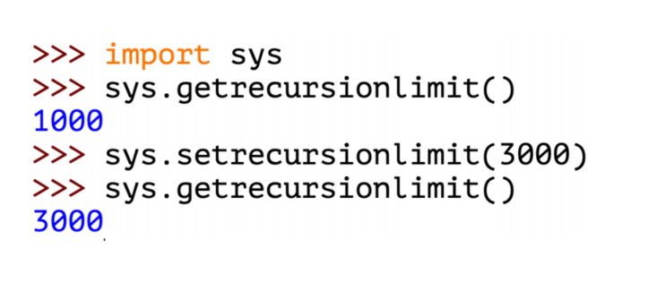

# 递归调用的实现
## 递归调用的实现
### 当一个函数被调用的时候，系统会把调用时的现场数据压入到系统调用栈
每次调用，压入栈的现场数据被称为**栈帧**  
每当函数返回时，要从调用栈的栈顶取得返回地址，恢复现场，弹出栈帧，按地址返回

## Python中的递归深度限制
### 在调试递归算法程序的时候经常会碰到这样的错误：RecursionError
递归的层数太多，系统调用栈容量有限

### 这时要检查程序中是否忘记设置基本结束条件，导致无限递归
或者向基本结束条件演进太慢，导致递归层数太多，调用栈溢出
```python
# 无限递归导致调用栈溢出
def tell_story():
    print("从前有座山，山里有座庙，，庙里有个老和尚讲故事，讲的是：")
    tell_story()

print("给你讲个故事")
tell_story()
```
## Python中的递归深度限制
### 在Python内置的sys模块可以获取和调整最大递归深度
