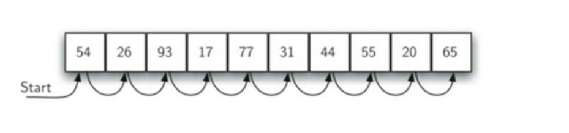
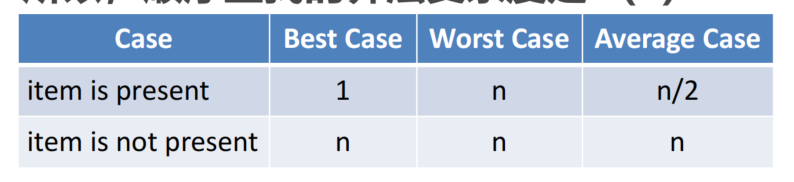
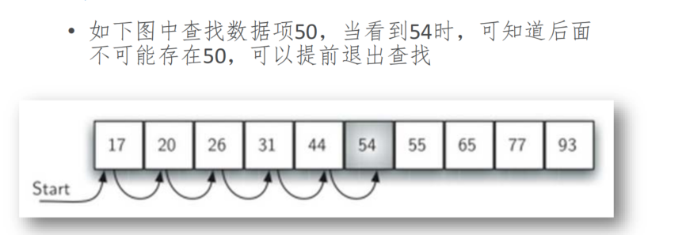
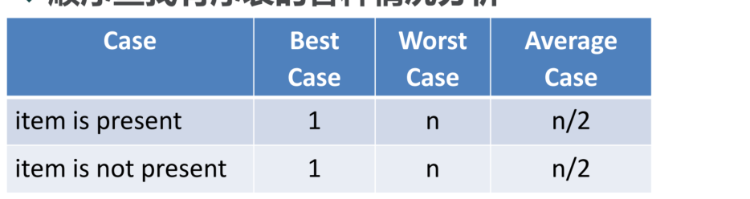

# 顺序查找算法及分析
## 顺序查找Sequential Search
+ 如果数据项保存在如列表这样的集合中，我们会称这些数据项具有线性或者顺序关系
+ 在Python List中，这些数据项的存储位置称为**下标（index）**，这些下标都是有顺序的整数。
+ 通过下标，我们可以按照顺序来访问和查找数据项，这种技术称为：“顺序查找”
+ 要确定列表中是否存在需要查找的数据项  
    首先从列表的第1个数据项开始，  
    按照下标增长的顺序，逐个比对数据项，  
    如果到最后一个都未发现要查找的项，那么查找失败

## 顺序查找：无序表查找代码
```python
def sequentialSearch(alist, item):
    pos = 0
    found = False
    while pos < len(alist) and not found:
        if alist[pos] == item:
            found = True
        else:
            pos += 1
    return found
```
## 顺序查找：算法分析
+ 要对查找算法进行分析，首先要确定其中的**基本计算步骤**
+ 回顾第二章算法分析的要点，这种基本计算步骤必须**足够简单**，并且在算法中**反复执行**
+ 在查找算法中，这种基本计算步骤就是进行数据项的**比对**  
    当前数据项<u>等于还是不等于</u>要查找的数据项，比对的次数决定了算法复杂度
+ 在顺序查找算法中，为了保证讨论的是一般情形，需要假定列表中的数据项并没有按值进行排序，而是**随机放置**在列表中的各个位置  
  换句话说，数据项在列表中各处出现的概率是相同的
+ 数据项是否在列表中，比对的次数是不一样的
+ 如果数据项不在列表中，那么就需要比对所有数据项才能得知，比对次数是n
+ 如果数据项在列表中，要比对的次数，其情况就比较复杂
  + 最好的情况，第1次比对就能找到
  + 最坏的情况，要n次比对
+ 数据项在列表中，比对的一般情形如何？
  + 因为数据项在列表中各个位置出现的概率是相同的；所以平均情况下，比对的次数是2/n
+ 所以，顺序查找的算法复杂度是O(n)
  
+ 这里我们假定列表中的数据项是无序的，那么如果我们排了序，顺序查找算法的效率又如何呢
+ 实际上，我们在第三章的有序表Search方法中介绍过顺序查找
  + 当数据项存在时，比对过程与无序表完全相同
  + 不同之处在于，如果数据项不存在，比对可以提前结束
  + 
## 顺序查找：有序查找代码
```python
def ordered_sequential_search(alist, item):
    pos = 0
    found = False
    stop = False
    while pos < len(alist) and not found and not stop:
        if alist[pos] == item:
            return True
        else:
            # 如果当前比对的元素已经比要查找的大了，那么后面肯定都比它大，就不用比了
            if alist[pos] > item:
                stop = True
                # 提前退出
            else:
                pos += 1
    return found
```
## 顺序查找：算法分析
+ 顺序查找有序表的各种情况分析

+ 实际上，就算法复杂度上来说，仍然是O(n)
+ 只是在数据项不存在的时候，有序表的查找能节省一些比对次数，但是并不改变其数量级