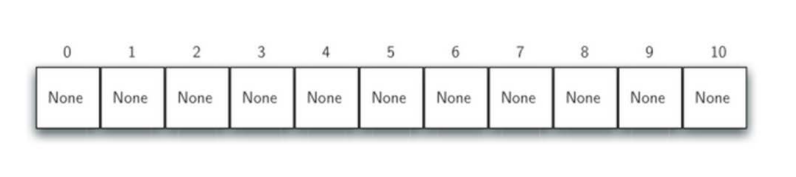
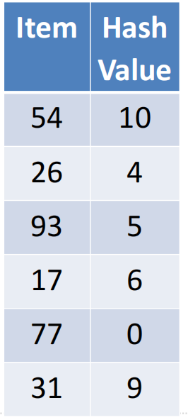
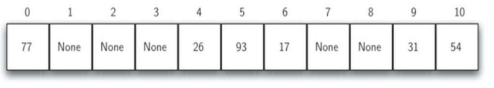

# 什么是散列
## 散列：Hashing
+ 前面我们利用数据集中关于数据项之间排序关系的知识，来将查找算法进行了提升
+ 如果数据项之间的关系按照**大小排好序**的话，就可以利用**二分查找**来降低算法复杂度
+ 现在我们进一步来构造一个新的数据结构，能使得查找算法的复杂度降到O(1)，这种概念称为“散列Hashing”
+ 能够使得查找的次数降低到**常数**级别，我们对数据项所处的位置就必须要有更多的**先验知识**
+ 如果我们**事先**能知道要找的数据项**应该**出现在数据集中的什么**位置**，就可以直接到那个位置看看数据项是否存在即可。
+ 那么，由数据项的**值**来确定其存放位置，如何能实现这一点呢
## 散列：基本概念
+ 散列表（hash table，又称为哈希表）是一种数据集，其中数据项的存储方式尤其有利于将来快速的查找定位。
+ 散列表中的每一个存储位置，称为槽（slot），可以用来保存数据项，**每个槽有一个唯一的名称**
+ 例如：一个包含11个槽的散列表，槽的名称分别为1~10
+ 在插入数据项之前，每个槽的值都是`None`，表示空槽

+ 实现从数据项到存储槽名称转换的，称为**散列函数**（hash function）
+ 下面示例中，散列函数接受**数据项**作为参数，返回**整数值**0~10，表示数据项存储的**槽号**（名称）
## 散列：示例
+ 为了将数据项保存在散列表中，我们设计第一个散列函数
  + 数据项：54,26,93,17,77,31
+ 有一种常用的散列方法是“**求余数**”，将数据项除以散列表的大小，得到的余数作为槽号。
  + 实际上“求余数”方法会以不同形式出现在所有散列函数里
  + **因为散列函数返回的槽号必须在散列表大小范围之内，所以一般会对散列表大小求余**
+ 本例中我们的散列函数是最简单的求余：
  + h(item) = item % 11
+ 按照散列函数h(item)为每个数据项计算出存放的位置之后，就可以将数据项存入相应的槽中

+ 例子中的6个数据项插入后，占据了散列表11个槽中的6个
  + 槽被数据项占据的比例称之为散列表的“负载因子”，这里的负载因子为6/11
+ 数据项都保存到散列表之后，查找就无比简单
+ 要查找某个数据项是否存在于表中，我们只需要使用同一个散列函数，对查找项进行计算，测试下返回的槽号所对应的槽中是否有数据项即可。
  + 实现了O(1)时间复杂度的查找算法
+ 不过，你可能也看出这个方案的问题所在，这组数据相当凑巧，各自占据了不同的槽
+ 假如还要保存44，h(44)=0，它跟77被分到了同一个0#槽中，这种情况被称为”**冲突collision**“，我们后面会讨论这个问题的解决方案
