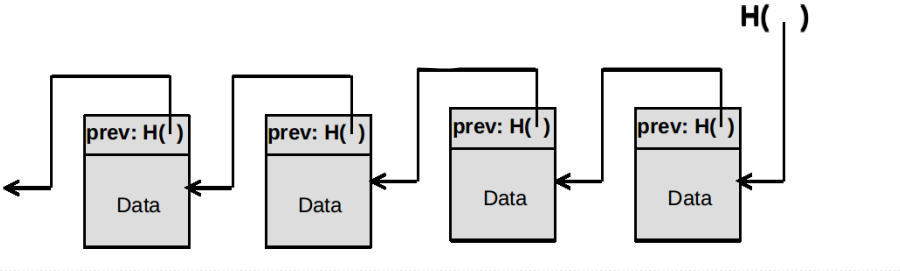
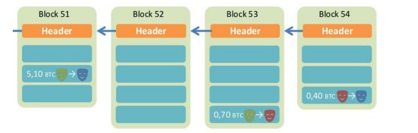
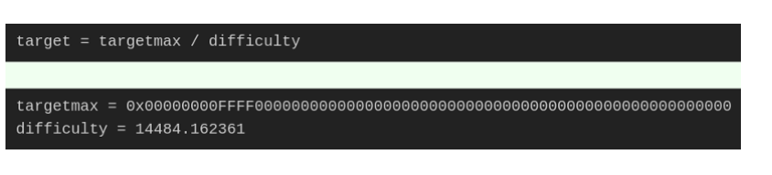
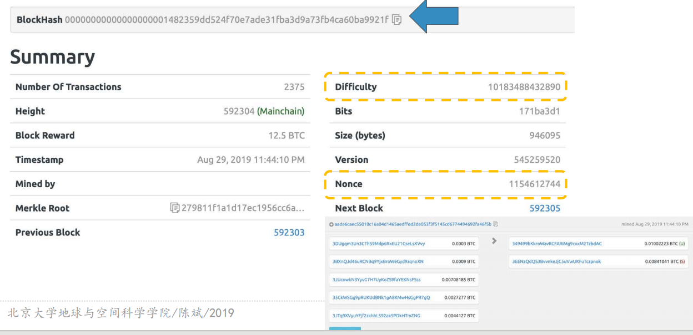
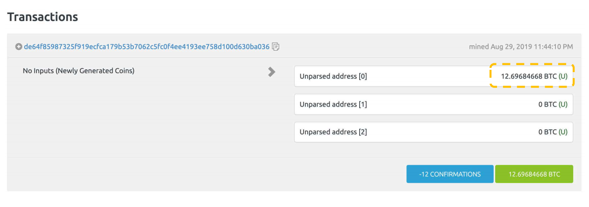
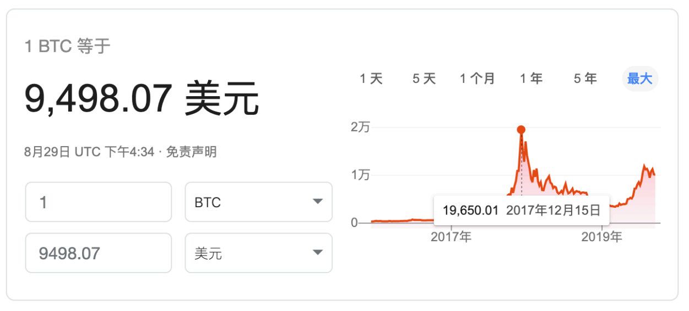
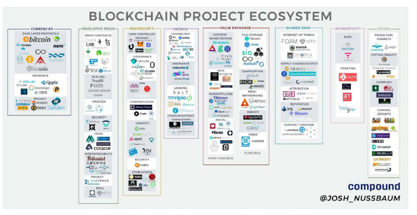

# 区块链技术
## 散列函数的最酷应用：区块链技术
+ 区块链是一种分布式数据库
  + 通过网络连接的节点
  + 每个节点都保存着整个数据库所有数据
  + 任何地点存入的数据都会完成同步

+ 区块链的最本质特征是：“去中心化”
  + 不存在任何控制中心、协调中心节点
  + 所有节点都是平等的，无法被控制
  + 如何做到不需要相互信任和权威，即可防止篡改和破坏？
## 区块链
+ 区块链由一个个区块（block）组成，区块分为头（head）和体（body）
+ 区块头记录了一些元数据和链接到前一个区块的信息
  + 生成时间、**前一个区块（head+body）的散列值**
+ 区块体记录了实际的数据

## 区块链不可修改性
+ 由于散列值具有抗修改性，任何对于某个区块数据的改动必然会引起散列值的变化
  + 为了不导致这个区块脱离链条，就需要修改所有后续的区块
  + 由于有“工作量证明”的机制，这种大规模修改是不可能实现的，除非掌握了全网51%以上的算力

## 工作量证明：Proof of Work（POW）
+ 由于区块链是大规模的分布式数据库，同步较慢，新区块的添加速度需要得到控制
  + 目前最大规模区块链Bitcoin采用的速度是平均每10分钟生成一个区块
+ 大家不惜付出海量的计算，去抢着算出一个区块的**有效**散列值
+ 最先算出的那位“矿工”才有资格把区块挂到区块链中
+ 散列不是非常容易计算么？为什么要付出海量计算？为什么要抢先？

## 为什么有效散列那么难计算出来？
+ 因为很难算出，所以控制了新区块生成的速度，便于在整个分布式网络中进行同步
+ 每个区块设置了一个难度系数Difficulty，用常数targetmax除以它，得到一个target，难度系数越高，target越小

+ 矿工的工作是，找到一个数值Nonce，把它跟整个区块数据一起计算散列，这个散列值必须小于target，才是有效的散列值
+ 由于散列值无法推回原值，这个Nonce的寻找只能靠暴力穷举，计算工作量+运气，是唯一的方法
## Bitcoin的一个区块 https://blockexplorer.com/
### Block #592304

## 为什么矿工抢着生成区块？
+ 因为有利益！
+ 在加密货币Bitcoin中，区块内包含的数据是“交易记录”，也就是“账本”，这对于货币体系来说至关重要
+ Bitcoin贵姓，每个区块中包含了一定数量的比特币作为“**记账奖励**”，这样就鼓励了更多人加入到抢先记账的行列
+ 由于硬件摩尔定律的存在，计算力将持续递增，为了维持每10分钟生成一个区块的速度，难度系数Difficulty也将持续递增
  + 挖矿计算力升级：CPU（20MHash/s）→GPU（400MHash/s）→FPGA（25GHash/s）→ASIC（3.5THash/s）→大规模集群挖矿（3.5THash/s*X）
+ 另外，为了保持货币总量不会无限增加，每4年奖励的比特币减半
  + 2008年开始是50个，2019年为12.5个
## 工作量证明

## 加密货币Bitcoin

## “矿工”的世界

## 区块链技术飞速扩张的应用
+ https://36kr.com/p/5114727.html
