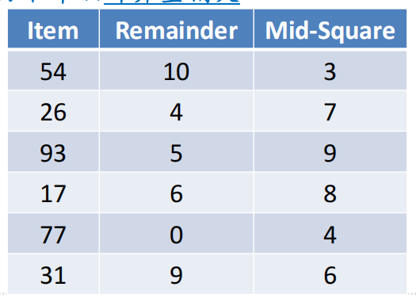

# 散列函数设计
## 散列函数设计：折叠法
+ 折叠法设计散列函数的基本步骤是：
  1. 将数据项按照位数分为若干个段
  2. 再将几段数字相加
  3. 最后再对散列表大小求余数，得到散列值
+ 例如，对电话号码62767255
  1. 可以两位两位分为4段（62、76、72、55）
  2. 相加（62+76+72+55=265）
  3. 散列表包括11个槽，那么就是265%11=1
  4. 所以h(62767255)=1
+ 有时候折叠法还会包括一个**隔数反转**的步骤
  + 比如（62、76、72、55）隔数反转为（62、**67** 、72、**55**）
  + 再累加（62+67+72+55=256）
  + 对11求余（256%11=3），所以h'(62767255)=3
+ 虽然隔数反转从理论上看来毫无必要，但是这个步骤确实为折叠法得到散列函数提供了一种**微调**的手段，以便更好得符合散列特性
## 散列函数设计：平方取中法
+ 平方取中法，首先将数据项做平方运算，然后取**平方数的中间两位**，再对散列表的大小求余
+ 例如，对44进行散列
  + 首先44*44=1936
  + 然后取中间的93
  + 对散列表大小11求余，93%11=5
+ 下表是两种散列函数的对比
  + 两个都是完美散列函数
  + 分散度都很好
  + 平方取中法**计算量稍大**

## 散列函数设计：非数项
+ 我们也可以对非数字的数据项进行散列，把字符串中的每个字符看作ASCII码即可
  + 如cat，ord('c')==99, ord('a')==96,ord('t')==116
+ 再将这些整数累加，对散列表大小求余

```python
def hash(str, table_size):
    sum = 0
    for pos in range(len(str)):
        sum += ord(str[pos])

    return sum % table_size
```
## 散列函数设计
+ 当然，这样的散列函数对所有的**变位词**都返回相同的散列值
  + 为了防止这一点，可以将字符串所在的位置作为**权重因子**，乘以ord值

+ 我们还可以设计出更多的散列函数方法，但是要坚持一个基本的出发点是，散列函数**不能**成为存储过程和查找过程的**计算负担**
+ 如果散列函数设计太过复杂，去花费大量的计算资源来计算槽号
  + 可能还不如简单地进行顺序查找或者二分查找
+ 失去了散列本身的意义