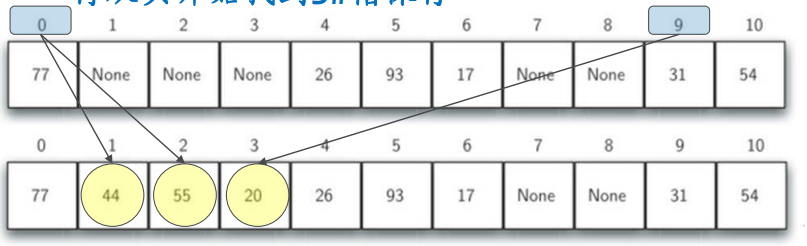
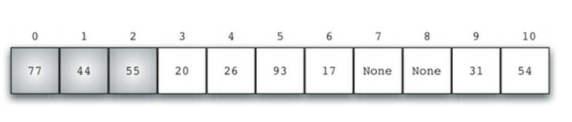
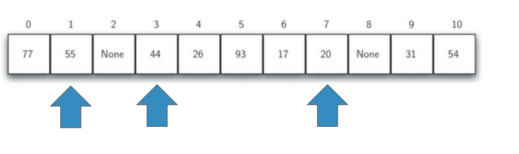
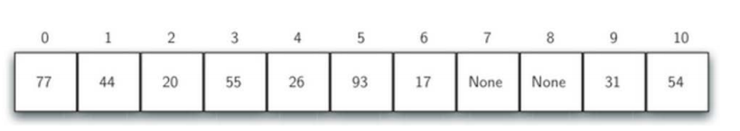
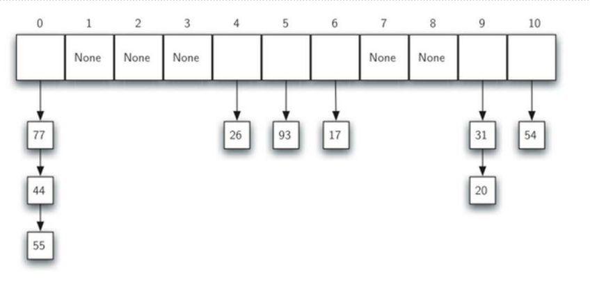

# 冲突解决方案

## 冲突解决方案

+ 如果两个数据项被散列到同一个槽，需要一个系统化的方法在散列表中保存第二个数据项，这个过程被称为“**解决冲突**”
+ 前面提到，如果散列函数是完美的，那就不会存在散列冲突，但是完美散列函数常常是不现实的
+ 解决散列冲突成为散列方法中很重要的一部分
+ 解决散列冲突的一种方法就是为冲突的数据项**再找一个**开放的空槽来保存
    + 最简单的就是从冲突的槽开始往后扫描，直到碰到一个空槽
    + 如果到散列表尾部还未找到，则从首部接着扫描
+ 这种**寻找空槽**的技术称为“**开放地址** open addressing”
+ 向后**逐个槽寻找**的方法则是开放地址技术中的“**线性探测** liner probing”

## 线性探测Liner Probing

+ 我们把44、55、20逐个插入到散列表中
    + h(44)=0，但发现0#槽已经被77占据，向后找到第一个空槽1#，保存
    + h(55)=0，同样0#槽被占用，向后找到第一个空槽2#，保存
    + h(20)=9,发现9#槽被31占用，向后，再从头开始找到3#槽保存
      
+ 采用线性探测法来解决散列冲突的话，则散列表的查找操作也遵循相同的原则
    + 如何在散列位置没有找到查找项的话，就必须向后做**顺序查找**
    + 直到找到查找项，或者碰到空槽（查找失败）。

## 线性探测的改进

+ 线性探测法的一个缺点就是有**聚集**（clustering）的趋势
+ 即如果同一个槽冲突的数据项较多的话，这些数据项就会在槽附近聚集起来
+ 从而连锁式影响其他数据项的插入
  

## 冲突解决方案：线性探测的改进

+ 避免聚集的一种方法就是将线性探测扩展，从逐个探测改为跳跃式探测
    + 下图是“+3”探测插入44、55、20
      

## 冲突解决方案：再散列rehashing

+ 重新寻找空槽的过程可以用一个更为通用的”**再散列rehashing**“来概括
    + newhashvalue = rehash(oldhashvalue)
    + 对于线性探测来说，rehash(pos) = (pos+ 1) % sizeoftable
    + “+3”的跳跃式探测则是：rehash(pos) = (pos+ 3)% sizeoftable
    + 跳跃式探测的再散列通式是：rehash(pos)=(pos+ skip)% sizeoftable
+ 跳跃式探测中，需要注意的是skip的取值，不能被散列表大小整除，否则会产生周期，造成很多空槽永远无法被探测到
    + 一个技巧是，把散列表的大小设置为素数，如例子中的：11
      
+ 还可以将线性探测变为“**二次探测**quadratic probing”
+ 不再固定skip的值，而是逐步增加skip值，如1、3、5、7、9
+ 这样槽号就回是原散列值以平方数增加：h,h+1,h+4,h+9,h+16

## 冲突解决方案：数据项链Chaining

+ 除了寻找空槽的开放地址技术之外，另一种解决散列冲突的方案是将容纳单个数据项的**槽**扩展为容纳**数据项集合**（或者对数据项链表的引用）
+ 这样，散列表中的每个槽就可以容纳多个数据项，如果有散列冲突发生，只需要简单地将数据项添加到数据项集合中。
+ 查找数据项时则需要查找同一个槽中的整个集合，当然，随着散列冲突的增加，对数据项的查找时间也会相应增加
  