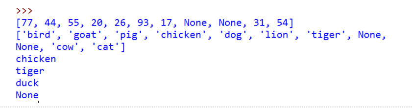

# 映射数据类型及Python实现
## 抽象数据类型“映射”：ADT Map
+ Python最有用的数据类型之一“字典”
+ 字典是一种可以保存key-data<u>键值对</u>的数据类型
  + 其中关键码key可用于查询关联的数据值data
+ 这种键值关联的方法称为“**映射Map**”
+ ADT Map的结构是键-值关联的无序集合
  + 关键码具有唯一性
  + 通过关键码可以唯一确定一个数据值
+ ADT Map定义的操作如下：
  + Map()：创建一个空的映射，返回空映射对象
  + put(key,val)：将key-val关联对加入到映射中，如果key已经存在，则用val替换旧值
  + get(key)：给定key，返回关联的数据值，如不存在，则返回None
  + del:通过del map[key]的语句形式删除key-val关联
  + len()：返回映射中key-val关联的数目
  + in：通过key in map的语句形式，返回key是否存在于关联中，布尔值
## 实现ADT Map
+ 使用字典的优势在于，给定关键码key，能够很快得到关联的数据值data
+ 为了达到**快速查找**的目标，需要一个支持高效查找的ADT实现
  + 可以采用列表数据结构加顺序查找或者二分查找
  + 然而，更为适合的是使用前述的散列表来实现，这样查找可以最快达到O(1)的性能
+ 下面，我们用一个HashTable类来实现ADT Map，该类包含了两个列表作为成员
  + 其中一个**slot列表**用来保存key
  + 另一个平行的**data列表**用于保存数据项
+ 在slot列表查找到一个key的位置以后，在data列表对应**相同位置**的数据项即为关联数据
## 实现ADT Map：应用实例
```python
H=HashTable()
H[54]="cat"
H[26]="dog"
H[93]="lion"
H[17]="tiger"
H[77]="bird"
H[31]="cow"
H[44]="goat"
H[55]="pig"
H[20]="chicken"
print(H.slots)
print(H.data)
print(H[20])
print(H[17])
H[20]='duck'
print(H[20])
print(H[99])
```

## 实现ADT Map
+ 保存key的列表就作为**散列表**来处理，这样可以迅速查找到指定的key
+ 注意散列表的大小，虽然可以是任意数，但是考虑到要让冲突解决算法能有效工作，应该选择为素数。
```python
class HashTable:
    def __init__(self):
        self.size = 11
        self.slots = [None] * self.size
        self.data = [None] * self.size
```
## 实现ADT Map：put方法代码
+ hashfunction方法采用了简单**求余**方法来实现散列函数，而冲突解决则采用**线性探测**”加1“再散列函数。
```python

    def hashfunction(self, key):
        return key % self.size

    def rehash(self, oldhash):
        return (oldhash + 1) % self.size

    def put(self, key, data):
        hashvalue = self.hashfunction(key)
        # key不存在，未冲突
        if self.slots[hashvalue] == None:
            self.slots[hashvalue] = key
            self.data[hashvalue] = data
        else:
            # key存在，替换val
            if self.slots[hashvalue] == key:
                self.data[hashvalue] = data
            else:
                # 散列冲突，再散列，直到找到空槽或者key
                nextslot = self.rehash(hashvalue)
                while self.slots[nextslot] != None and self.slots[nextslot] != key:
                    nextslot = self.rehash(nextslot)

                if self.slots[nextslot] == None:
                    self.slots[nextslot] = key
                    self.data[nextslot] = data
                else:
                    self.data[nextslot] = data

```
## 实现ADT Map：get方法
```python
    def get(self, key):
        # 标记散列值为查找起点
        startslot = self.hashfunction(key)
        data = None
        stop = False
        found = False
        position = startslot
        # 找key，直到空槽或者回到起点
        while self.slots[position] is not None and not found and not stop:
            if self.slots[position] == key:
                found = True
                data = self.data[position]
            else:
                # 未找到key，再散列继续找
                position = self.rehash(position)
                if position == startslot:
                    # 回到起点，停止
                    stop = True
        return data
```
## 实现ADT Map：附加代码
+ 通过特殊方法实现[]访问
```python
    def __getitem__(self, key):
        return self.get(key)

    def __setitem__(self, key, data):
        self.put(key, data)
```
## 散列算法分析
+ 散列在最好的情况下，可以提供O(1)常数级别的时间复杂度的查找性能
  + 由于有散列冲突的存在，查找比较次数就没有这么简单
+ 评估散列冲突的最重要信息就是负载因子λ， 一般来说：
  + 如果λ较小，散列冲突的几率就小，数据项通常会保存在其所属的散列槽中
  + 如果λ较大，意味着散列表填充较满，冲突会越来越多，冲突解决也越复杂，也就需要更多的比较来找到空槽；如果采用数据链的话，意味着每条链上的数据项增多
+ 如果采用线性探测的开放地址法来解决冲突（λ在0~1之间）
  + 成功的查找，平均需要比对次数为：1/2*(1+1/(1-λ))
  + 不成功的查找，平均比对次数为：1/2*(1+(1/(1-λ))^2)
+ 如果采用数据链来解决冲突（λ可以大于1）
  + 成功的查找，平均需要比对次数为：1+λ/2 
  + 不成功的查找，平均比对次数为：λ