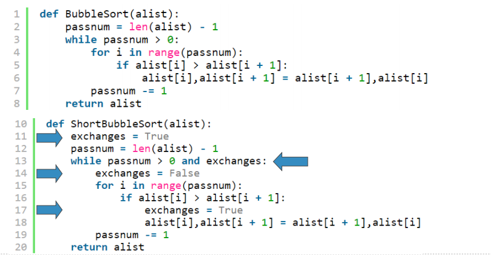

# 排序与查找小结
## 本章小结
+ 在无序表或者有序表上的顺序查找，其时间复杂度为O(n)
+ 在有序表上进行二分查找，其最差复杂度为O(log n)
+ 散列表可以实现常数级时间的查找
+ 完美散列函数作为数据一致性校验，应用很广
+ 区块链技术是一种去中心化的分布式数据库，通过“工作量证明”机制来维持运行
+ 冒泡、选择和插入排序是O(n^2)的算法
+ 谢尔排序在插入排序的基础上进行了改进，采用对递增子表排序的方法，其时间复杂度可以在O(n)和O(n2)之间
+ 归并排序的时间复杂度是O(nlog n)，但归并的过程需要额外存储空间
+ 快速排序最好的时间复杂度是O(nlog n)，也不需要额外的存储空间，但如果分裂点偏离列表中心的话，最坏情况下会退化到O(n2)
## 算法的选择：一封同学的来信
+ 冒泡排序算法中提到一个对其改进的算法
  + 利用“如果一趟比对未产生任何交换，则已排好序”的“短路”特性，消除无效比对，理应更快

+ 但有细心的同学自己动手做了试验，结果不太乐观：
  + 我试了一下排序算法
  + 发现shortBubbleSort比BubbleSort慢很多啊（每组数据运行10次取平均） 
  + 算法就是照着幻灯片上写的，为什么呢？
+ 第一次数据：
```text
alist = [i for i in range(10) for j in range(10)]（再用shuffle打乱）
{'Sort': 0.0, 'shuffle': 0.0, 'SelectionSort': 0.0, 'InsertionSort': 0.0, 'BubbleSort': 0.0, 
'ShortBubbleSort': 0.0016000032424926757, 'ShellSort': 0.0}
```
+ 第二次数据：
```text
alist = [i for i in range(100) for j in range(100)]（再用shuffle打乱）
{'Sort': 0.0, 'shuffle': 0.0, 'SelectionSort': 2.8600001335144043, 'InsertionSort': 
3.8279998302459717, 'BubbleSort': 7.0, 'ShortBubbleSort': 7.921999931335449, 'ShellSort': 
0.04700016975402832}
```
+ 第三次数据：
```text
alist = [i for i in range(1000) for j in range(100)]（再用shuffle打乱）
{'Sort': 0.031000137329101562, 'shuffle': 0.031000137329101562, 'SelectionSort': 
297.72199988365173, 'InsertionSort': 397.25999999046326, 'BubbleSort': 765.3139998912811, 
'ShortBubbleSort': 847.1009998321533, 'ShellSort': 0.6410000324249268}
（运行了一天）
```
+ 为什么理论和实际相差甚远？
  + 到底还能不能愉快地选择一个好算法了？
+ ShortBubbleSort的“短路”优势高度依赖于数据的初始布局
  + 如果数据布局的随机度很高，造成每趟比对都会发生交换的话，ShortBubbleSort就完全没有优势，还要额外付出一个exchanges变量和相应赋值语句的代价，反倒比原始的冒泡排序要慢。
+ 同学的测试代码没有问题，问题在于排序对象，其数据是经过random.shuffle来乱序的
  + 首先，alist是用range嵌套生成，生成的数据从小到大排列，非常整齐； 
  + 而这个shuffle会尽量把数据打乱到最混乱的程度，造成数据布局随机度很高； 
  + 这样，ShortBubbleSort的短路特性就完全失效，还要付出exchanges变量的判断、赋值代价，实测比原始冒泡排序算法要慢不少。
+ 所以排序算法有时候并不存在绝对的优劣，尤其是时间复杂度相同的算法们
+ 要在特定的应用场合取得最高排序性能的话，还需要对**数据本身**进行分析，针对数据的特性来选择相应排序算法
+ 另外，除了时间复杂度，有时候空间复杂度也是需要考虑的关键因素
  + 归并排序的时间复杂度O(nlog n)，但是需要额外一倍的存储空间
  + 快速排序事件复杂度最好的情况是O(nlog n)，而且不需要额外存储空间，但“中值”的选择又成为性能的关键，选择不好的话，极端情况性能甚至低于冒泡排序
+ 算法选择不是一个绝对的优劣判断，需要综合考虑各方面的因素
  + 包括运行环境要求、处理数据对象的特性
