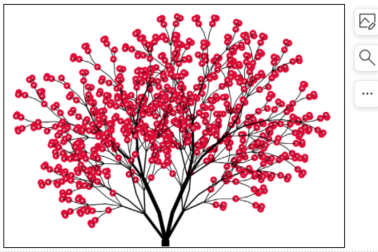
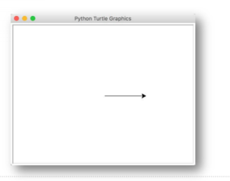
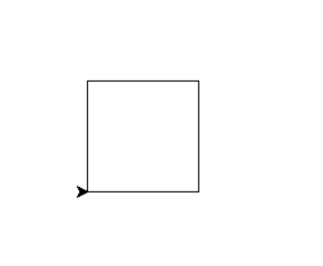
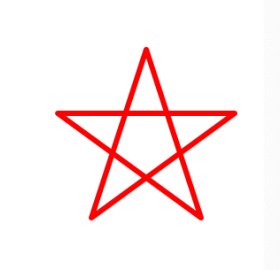
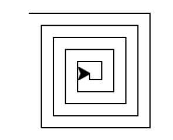
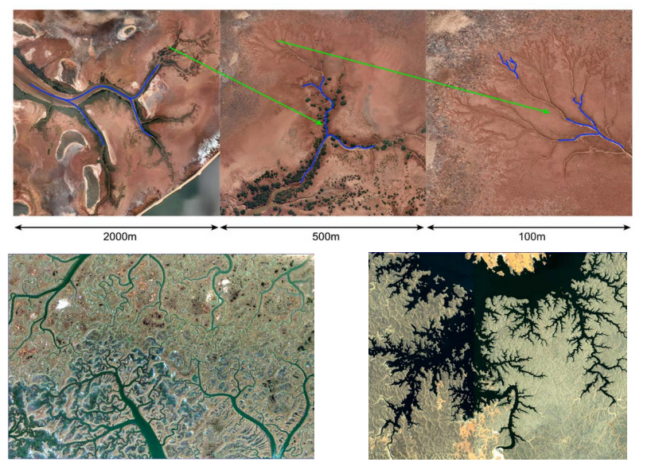
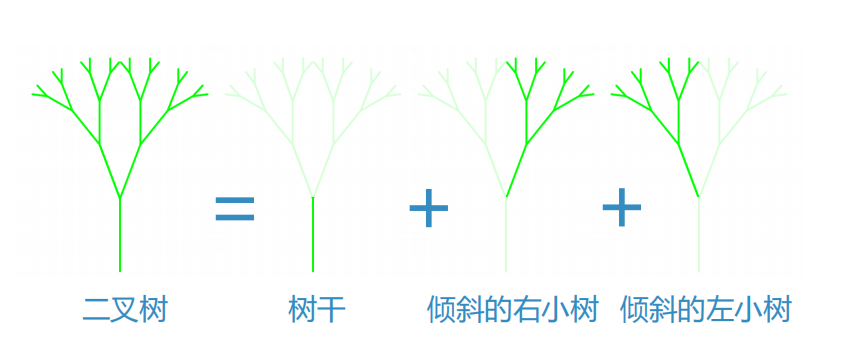
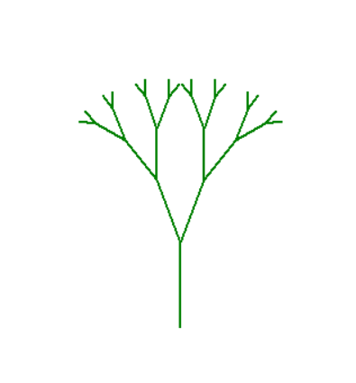

# 递归可视化：分形树
## 递归可视化：图示
### 前面的种种递归算法展现了其简单而强大的一面，但还是难有个直观的概念
### 下面我们通过递归作图来展现递归调用的视觉影象

### Python的海龟作图系统turtle module
Python内置，随时可用，以LOGO语言的创意为基础  
其意象为模拟海龟在沙滩上爬行而留下的足迹  
爬行：forward(n); backward(n)  
转向：left(a); right(a)  
抬笔放笔：penup(); pendown()  
笔属性：pensize(s); pencolor(c)

```python
import turtle
t = turtle.Turtle()

# 作图开始
t.forward(100) # 指挥海龟作图

# 作图结束
turtle.done()
```

```python
# 海龟作图，正方形
import turtle
t = turtle.Turtle()

# 作图开始
for i in range(4):
    t.forward(100)
    t.left(90)

# 作图结束
turtle.done()
```

```python
import turtle

t = turtle.Turtle()
t.pensize(3)
t.pencolor('red')

for i in range(5):
    t.forward(100)
    t.right(144)

t.hideturtle()

turtle.done()
```

## 一个递归作图的例子：螺旋
```python
# 递归作图：螺旋

import turtle

t = turtle.Turtle()


def draw_spiral(t: turtle.Turtle, length):
    if length > 0: # 最小规模0，直接退出
        t.forward(length)
        t.left(90)
        draw_spiral(t, length - 5) # 减小规模，边长-5，调用自身


draw_spiral(t, 100)
turtle.done()
```

## 分形树：自相似递归图形
### 分形Fractal，是1975年由Mandelbrot开创的新学科
“一个粗糙或零碎的几何形状，可以分成数个部分，且每一部分都（至少近似地）是整体缩小后的形状”，即具有自相似的性质。

### 自然界中能够找到众多具有分型性质的物体
海岸线、山脉、闪电、云朵、雪花、树  
http://paulbourke.net/fractals/googleearth/  
http://recursivedrawing.com/
## 自然界是不平滑的

## 分形树：自相似递归图形
### 自然现象中所具备的分形特性，使得计算机可以通过分形算法生成非常逼真的自然场景
### 分形是在不同尺度上都具有相似性的实物
我们能看出一棵树的每个分叉和每条树枝，实际上都具有整棵树的外形特征（也是逐步分叉的）
### 这样我们就可以把树分解为三个部分：树干、左边的小树和右边的小树
分解后正好符合递归的定义：对自身的调用

## 分形树：代码
```python
import turtle

def tree(t:turtle.Turtle, branch_len):
    if branch_len > 5: # 如果树干太短，就不画，即递归结束条件
        t.forward(branch_len) # 画树干
        t.left(20) # 左倾斜20
        tree(t, branch_len -15) # 画左子树，树干-15
        t.right(40) # 右倾斜40
        tree(t, branch_len -15) # 画右子树，树干-15
        t.left(20) # 左倾斜20 ，回正
        t.back(branch_len) # 退回原始位置

if __name__ == '__main__':
    t = turtle.Turtle()
    t.left(90)
    t.penup()
    t.back(100)
    t.pendown()
    t.pencolor('green')
    t.pensize(2)
    tree(t, 75)
    t.hideturtle()
    turtle.done()
```
