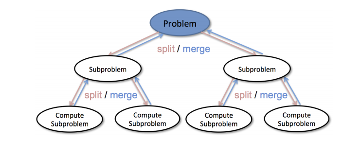
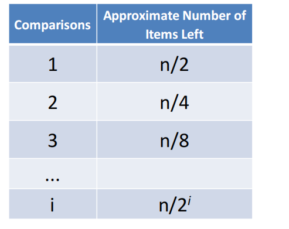
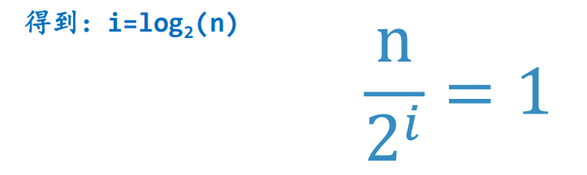

# 二分查找算法及分析
## 二分查找
+ 那么对于有序表，有没有更好更快的查找算法
+ 在顺序查找中，如果第1个数据项不匹配查找项的话，那么最多还有n-1个待比对的数据项
+ 那么，有没有办法能利用**有序表**的特性，迅速缩小待比对数据项的范围呢
+ 我们从列表的中间开始比对！
  + 如果列表中间的项匹配查找项，则查找结束
  + 如果不匹配，那么就有两种情况：
    1. 列表中间项比查找项大，那么查找项只可能出现在前半部分
    2. 列表中间项比查找项小，那么查找项只可能出现在列表的后半部分
  + 无论如何，我们都会将比对范围缩小到原来的一半:n/2
+ 继续采用上面的方法查找
  + 每次都会将对比范围缩小一半
## 二分查找：代码
```python
def binarySearch(alist, item):
    first = 0
    last = len(alist) - 1
    found = False
    while first <= last and not found:
        midpoint = (first + last) // 2
        if alist[midpoint] == item:
            found = True
        else:
            if item < alist[midpoint]:
                last = midpoint - 1
            else:
                first = midpoint + 1
    return found
```
## 二分查找：分而治之
+ 二分查找算法实际上体校了解决问题的典型策略：**分而治之**
  + 将问题分为若干个更小规模的部分
  + 通过解决每一个小规模部分问题，并将结果汇总得到原问题的解
  
  + 显然，递归算法就是一种典型的分治策略算法，二分法也适用于递归算法来实现
```python
def binary_search(alist, item):
    if len(alist) == 0:
        return False
    else:
        midpoint = len(alist) // 2
        if alist[midpoint] == item:
            return True
        else:
            if item < alist[midpoint]:
                return binary_search(alist[:midpoint], item)
            else:
                return binary_search(alist[midpoint + 1:], item)
```
## 二分查找：算法分析
+ 由于二分查找，每次比对都将下一笔的比对范围**缩小一半**
+ 每次对比之后剩余的数据项如下表所示
  
+ 当对比次数足够多以后，对比范围内只会剩下一个数据项
+ 无论这个数据项是否匹配查找项，比对最终都会结束，解以下方程：
  
+ 所以二分查找算法的复杂度是O(log n)
## 二分查找：进一步的考虑
+ 虽然我们根据比对的次数，得出二分查找的复杂度O(log n)
+ 但本算法中除了比对，还有一个因素要注意：
  + binarySearch(alist[:midpoint],item)
  + 这个递归调用使用了列表**切片**，而切片操作的复杂度是O(k)，这样会使得整个算法的时间复杂度稍微有所增加
  + 当然，我们采用切片操作是为了程序可读性更好，实际上也可以不用切片，而只是传入起始和结束的索引值即可，这样就不会有切片的时间开销了
+ 另外，虽然二分查找在时间复杂度上优于顺序查找
+ 但是也要考虑到**对数据项进行排序**的开销
  + 如果一次排序后，可以进行多次查找，那么排序的开销就可以摊薄
  + 如果数据项经常变动，查找的次数相对较少，那么可能还是直接用无序表加上顺序查找来得经济
+ 所以在算法选择的问题上，光看时间复杂度的优劣是不够的，还需要考虑**实际应用**的情况