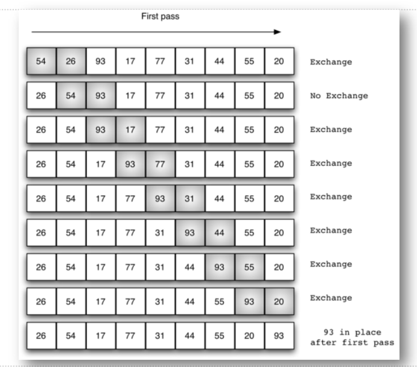
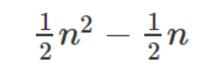
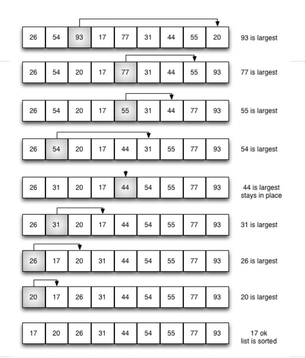

# 冒泡排序算法和选择排序算法及分析
## 排序：冒泡排序Bubble Sort
+ 冒泡排序的算法思路在于对无序表进行多趟比较交换
+ 没糖包括了多次两两相邻比较，并将逆序的数据项互换位置，最终能将本趟的最大项就位
+ 经过n-1趟比较交换，实现整表排序
+ 每趟的过程类似于“气泡”在水中不断上浮到水面上的经过
+ 第1趟比较交换，共有n-1对相邻的数据进行比较
  + **一旦经过最大项，则最大项会一路交换到达最后一项**
+ 第2趟比较交换时，最大项已经就位，需要排序的数据减小为n-1，共有n-2对相邻数据进行比较
+ 直到第n-1趟完成后，最小项一定在列表首位，就无需再处理了
## 冒泡排序：第1趟

## 冒泡排序：代码
```python
def bubbleSort(alist):
    for passnum in range(len(alist) - 1, 0, -1):
        # n-1趟
        for i in range(passnum):
            if alist[i] > alist[i + 1]:
                # 错序，交换
                # temp = alist[i]
                # alist[i] = alist[i + 1]
                # alist[i + 1] = temp

                # Python支持直接交换
                alist[i], alist[i + 1] = alist[i + 1], alist[i]


alist = [54, 26, 93, 17, 77, 31, 44, 55, 20]
bubbleSort(alist)
print(alist)

```
## 冒泡排序：算法分析
+ 无序表初始数据项的排列对于冒泡排序来说没有任何影响
+ 算法过程总共需要n-1趟，随着趟数的增加，**比对**次数逐步从n-1减小到1，并包括可能发生的数据项**交换**
+ 比对次数是：1~n-1的累加：
+ 对比的事件复杂度**O(n^2)**
+ 关于交换次数，时间复杂度也是O(n^2)，通常每次交换包括3次赋值操作
+ **最好**情况下，列表已经有序，交换次数为0
+ **最差**情况下，每次比对都要交换，交换次数等于比对次数
+ **平均**情况下，是最差情况的一半
+ 冒泡排序通常作为时间效率比较差的排序算法，来作为其他算法的对比基准
+ 其效率主要差在：每个数据找到其最终位置之前，都需要进行**多次**比对和交换，其中大部分的操作是**无效**的。
+ 但是有一点优势，就是**无需**任何额外的存储空间开销
## 冒泡排序：性能改进
+ 另外，通过检测每趟比对是否发生过交换，可以提前确定排序是否完成
+ 这也是其他多数排序算法无法做到的
+ 如果某一趟比对没有发生任何交换，说明列表已经排好序，可以提前结束算法
```python
def shortBubbleSort(alist):
    exchange = True
    passnum = len(alist) - 1

    while passnum > 0 and exchange:
        exchange = False
        for i in range(passnum):
            if alist[i] > alist[i + 1]:
                exchange = True
                temp = alist[i]
                alist[i] = alist[i + 1]
                alist[i + 1] = temp
        passnum -= 1

alist = [20, 30, 40, 90, 50, 60, 70, 80, 100, 110]
shortBubbleSort(alist)
print(alist)

```
## 选择排序Selection Sort
+ 选择排序对冒泡排序进行了改进，保留了其基本的多趟对比的思路，每一趟都使得最大项就位。
+ 但是选择排序对交换操作进行了削减，相比起冒泡排序进行多次交换，它每一趟只进行一次交换，记录最大项的所在位置，最后再跟本趟最后一项交换
+ 选择排序的时间复杂度比起冒泡排序稍优
  + 对比次数不变，还是O(n^2)
  + 交换次数则减少为O(n)


## 选择排序：代码
