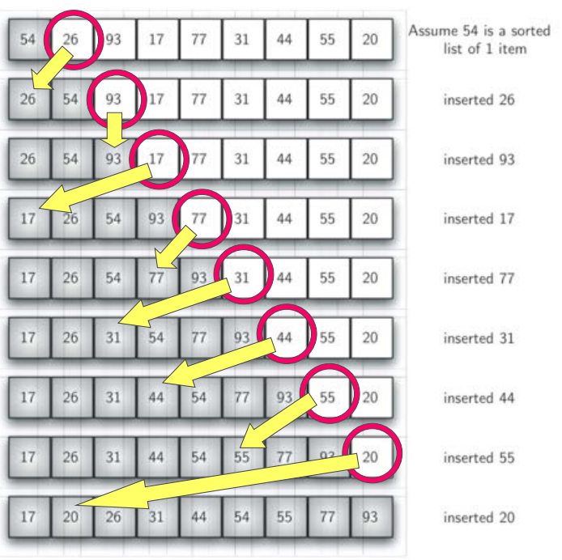
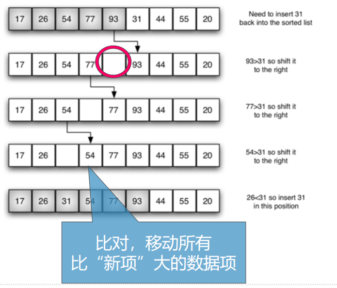

# 插入排序算法及分析
## 插入排序Insertion Sort
+ 插入排序的时间复杂度仍然是O(n^2)，但算法思路与冒泡排序、选择排序不同。
+ 插入排序维持一个已排好序的子列表，其位置始终在列表的前部，然后逐步扩大这个子列表直到全表
+ 第1趟，子列表仅包含第一个数据项，将第2个数据项作为“新项”插入到子列表的合适位置中，这样已排序的子列表就包含了2个数据项
+ 第2趟，再将第3个数据项跟前2个数据项进行比对，并移动比自身大的数据项，空出位置来，以便加入到子列表中
+ 经过n-1趟比对和插入，子列表扩展到全表，排序完成
+ 插入排序的比对主要用来寻找 **“新项”** 的 **”插入位置“**
+ 最差情况是每趟都与子列表中的所有项进行比对，总比对次数与冒泡排序相同，数量级仍然是O(n^2)
+ 最好情况，列表已经排好序的时候，每趟仅需要1次比对，总次数是O(n)



## 插入排序：思路


## 插入排序：代码
```python
def insertionSort(alist):
    for index in range(1,len(alist)):
        currentvalue = alist[index]
        position = index
        while position > 0 and alist[position-1]>currentvalue:
            alist[position] = alist[position-1]
            position = position-1

        alist[position] = currentvalue
```