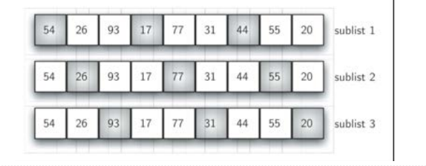
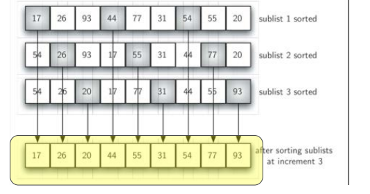
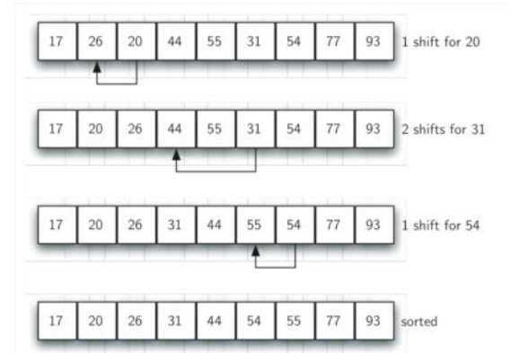
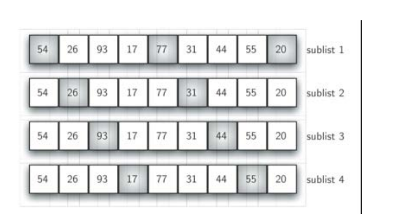

# 谢尔排序算法及分析
## 谢尔排序Shell Sort
+ 我们注意到插入排序的比对次数，在最好的情况下是O(n)，这种情况发生在列表已经是有序的情况下，实际上，**列表越接近有序，插入排序的比对次数就越少**
+ 从这个情况入手，谢尔排序以插入排序作为基础，对无序表进行“间隔”划分子列表，每个子列表都执行插入排序


+ 随着子列表的数量越来越少，无序表的整体越来越接近有序，从而减少整体排序的比对次数
+ 间隔为3的子列表，子列表分别插入排序之后，整体情况更接近有序


+ 最后一趟是标准的插入排序，但由于前面几趟已经将列表处理到接近有序，这一趟仅需要少数几次移动即可完成


+ 子列表的间隔一般从n/2开始，每趟倍增：n/4,n/8......直到1



## 谢尔排序：代码
```python
def shellSort(alist):
    sublistcount = len(alist) // 2  # 设定间隔
    while sublistcount > 0:
        # 子列表排序
        for startposition in range(sublistcount):
            gapInsertionSort(alist, startposition, sublistcount)
        print("After increments of size", sublistcount, "The list is ", alist)
        
        # 减小间隔
        sublistcount = sublistcount // 2


def gapInsertionSort(alist, start, gap):
    for i in range(start + gap, len(alist), gap):
        currentvalue = alist[i]
        position = i
        while position >= gap and currentvalue < alist[position - gap]:
            alist[position] = alist[position - gap]
            position = position - gap
        alist[position] = currentvalue


if __name__ == '__main__':
    alist = [1, 2, 7, 45, 3234, 75, 23, 42, 56, 2, 9, 43, 22, 64]
    shellSort(alist)
    print(alist)

```
+ 粗看上去，谢尔排序以插入排序为基础，可能并不会比插入排序好
+ 但是由于每一趟都使得列表更加接接近有序，这个过程会减少很多原先需要的“**无效**”比对
  + 对谢尔排序的详尽分析比较复杂，大致说是介于O(n)和O(n^2)之间
+ 如果将间隔保持在2^k-1(1、3、5、7、15、31等等)，谢尔排序的时间复杂度约为O(n^3/2)