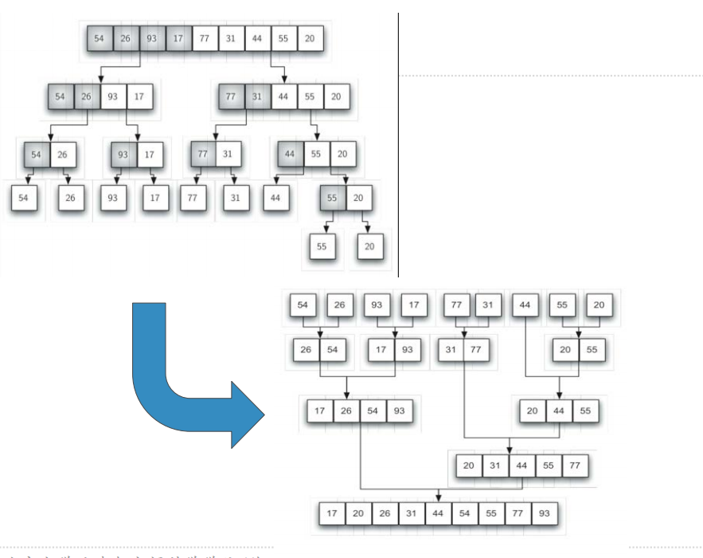

# 归并排序算法及分析
## 归并排序Merge Sort
+ 下面我们来看看**分治策略**在排序中的应用
+ 归并排序是递归算法，思路是将数据表持续分裂为两半，对两半分别进行归并排序
  + 递归的**基本结束条件**是：数据表仅有1个数据项，自然是排好序的
  + **缩小规模**：将数据表分为相等的两半，规模减小为原来的二分之一
  + **调用自身**：将两半分别调用自身排序，然后将分别排好序的两半进行归并，得到排序好的数据表


## 归并排序：代码
```python
def mergeSort(alist):
    # 基本结束条件
    if len(alist) > 1:
        mid = len(alist) // 2
        lefthalf = alist[:mid]
        righthalf = alist[mid:]
        # 递归调用
        mergeSort(lefthalf)
        mergeSort(righthalf)

        i = j = k = 0
        # 拉链式交错把左右半部分从小到大归并到结果列表中
        while i < len(lefthalf) and j < len(righthalf):
            if lefthalf[i] < righthalf[j]:
                alist[k] = lefthalf[i]
                i += 1
            else:
                alist[k] = righthalf[j]
                j += 1
            k += 1
        # 归并左半部分剩余项
        while i < len(lefthalf):
            alist[k] = lefthalf[i]
            i += 1
            k += 1
        # 归并右半部分剩余项
        while j < len(righthalf):
            alist[k] = righthalf[j]
            j += 1
            k += 1


if __name__ == '__main__':
    alist = [1, 2, 7, 45, 3234, 75, 23, 42, 56, 2, 9, 43, 22, 64]
    mergeSort(alist)
    print(alist)

```
## 另一个归并排序代码（更Pythonic）
```python
# merge sort
# 归并排序

def merge_sort(lst):
    # 递归结束条件
    if len(lst) <= 1:
        return lst

    # 分解问题，并递归调用
    middle = len(lst) // 2
    left = merge_sort(lst[:middle])  # 左半部分排序
    right = merge_sort(lst[middle:])  # 右半部分排序

    # 合并左右半部分，完成排序
    merged = []
    while left and right:
        if left[0] <= right[0]:
            merged.append(left.pop(0))
        else:
            merged.append(right.pop(0))
    merged.extend(right if right else left)
    return merged

```
## 归并排序：算法分析
+ 将归并排序分为两个过程来分析：**分裂** 和 **归并**
+ 分裂的过程，借鉴二分查找中的分析结果，是对数复杂度，时间复杂度为O(logn)
+ 归并的过程，相对于分裂的每个部分，其所有数据项都会被比较和放置一次，所以是线性复杂度，其时间复杂度是O(n)
  + 综合考虑，每次分裂的部分都进行一次O(n)的数据归并，总的时间复杂度是O(n*logn)
+ 最后，我们注意到还有两个切片操作
  + 为了事件复杂度分析精确起见
  + 可以通过**取消切片**操作，改为传递两个分裂部分的起始点和终止点，也是可以的，只是算法的可读性稍微牺牲一些。
+ 但是需要注意，归并排序使用了**额外1倍**的存储空间来用于归并
+ 这个特性在对特大数据集进行排序的时候要考虑进去