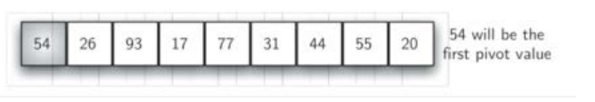
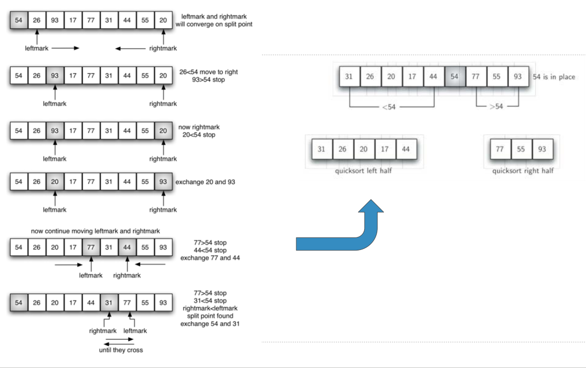

# 快速排序算法及分析
## 快速排序Quick Sort
+ 快速排序的思路是依据一个“**中值**”数据项来把数据表分为“**两半**”：小于中值的一半和大于中值的一半，然后每部分分别进行快速排序（递归）
  + 如果希望这两半拥有相等数量的数据项，则应该找到数据表的“中位数”
  + 但是找中位数需要计算开销！要想没有开销，只能随意找一个数来充当“中值”、
  + 比如：第1个数

+ 快速排序的递归算法“递归三要素”如下:
  + **基本结束条件**：当数据表仅有一个数据项，自然是排好序的
  + **缩小规模**：根据“中值”，将数据表分为两半，最好情况是相等规模的两半
  + **调用自身**：将两半分别调用自身进行排序（排序基本操作在分裂过程中）
## 快速排序：图示
* 分裂数据表的目标：找到“中值”的位置
* 分裂数据表的手段
  * 设置左右标（left/rightmark）
  * 左标向右移动，右标向左移动
    * 左标一直向右移动，碰到比中值大的就停止
    * 右标一直向左移动，碰到比中值小的就停止
    * 然后把左右标所指的数据项**交换**
  * 继续移动，直到左标移动到右标的右侧，停止移动
  * 这时右标所指位置就是“中值”应处的位置
  * 将中值和这个位置**交换**
  * **分裂完成**，左半部分比中值小，右半部分比中值大

## 快速排序：代码
```python
def quickSort(alist):
    quickSortHelper(alist, 0, len(alist) - 1)


def quickSortHelper(alist, first, last):
    # 基本结束条件
    if first < last:
        # 分裂
        splitpoint = partition(alist, first, last)
        # 递归调用
        quickSortHelper(alist, first, splitpoint - 1)
        quickSortHelper(alist, splitpoint + 1, last)


def partition(alist, first, last):
    # 选定“中值”
    privotvalue = alist[first]
    # 初始化左右标
    leftmark = first + 1
    rightmark = last

    done = False
    while not done:
        # 向右移动左标，直到第一个比“中值”大的
        while leftmark <= rightmark and alist[leftmark] <= privotvalue:
            leftmark += 1
        # 向左移动右标，直到第一个比“中值”小的
        while rightmark >= leftmark and alist[rightmark] >= privotvalue:
            rightmark -= 1
        # 两标相错就结束移动
        if leftmark > rightmark:
            done = True
        else:
            # 交换左右标的值
            temp = alist[leftmark]
            alist[leftmark] = alist[rightmark]
            alist[rightmark] = temp
    # 最后就位“中值”
    temp = alist[first]
    alist[first] = alist[rightmark]
    alist[rightmark] = temp
    # 返回中值点，也就是分裂点
    return rightmark


alist = [54, 26, 93, 17, 77, 31, 44, 55, 20]
quickSort(alist)
print(alist)

```
## 快速排序：算法分析
+ 快速排序过程分为两部分：**分裂**和**移动**
  + 如果分裂**总能**把数据表分为**相等**的**两部分**，那么就是O(logn)的复杂度
  + 而移动需要将每项与中值进行比对，还是O(n)
+ 综合算起来就是O(n*logn)
+ 而且，算法运行过程中，不需要额外的存储空间
+ 但是，如果不那么幸运的话，中值所在的分裂点过于偏离中部，造成左右两部分数量不平衡
+ 极端情况，有一部分始终没有数据，这样，时间复杂度就会退化到O(n^2)
  + 还要加上递归调用的开销（比冒泡排序还要糟糕）
+ 可以适当改进下**中值**的选取方法，让中值更有代表性
  + 比如“三点取样”，从数据表的头、尾、中间选取中值
  + 会产生额外计算开销，仍然不能排除极端情况
+ 还有什么采样具有代表性