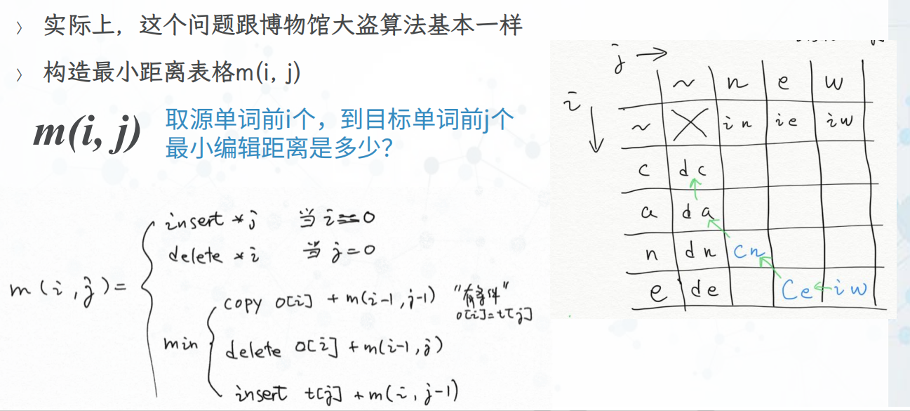

# W09
## 线下课堂
+ 【H3】动态规划作业详解
+ 本周内容小结：排序查找（上）
+ 问题解答
+ 慕课测验题讲解
+ 【K07】课堂练习
## 【H3-1】作业详解：博物馆大盗

+ 主要是输出选择的宝物
+ 在m(i,W)中记录：[最大价值，加了哪个宝物得到的最大价值]
+ 小技巧：让宝物编码从1开始（让0代表没有宝物）
```python
def dpMuseumThief(treasureList, maxWeight):
    maxValue = 0
    chosenList = []

    # 请在此编写你的代码（可删除pass语句）
    tr = [None] + treasureList  # 让宝物编码从1开始
    # 初始化二维表格m[(i,w)]，均为0，None
    # 表示前i个宝物中，最大重量w的组合，所得到的最大价值
    # 以及加了哪个宝物得到的这个最大价值
    # 当i什么都不取，或w上限为0，价值均为0
    m = {(i, w): [0, None] for i in range(len(tr)) for w in range(maxWeight + 1)}
    for i in range(1, len(tr)):
        for w in range(1, maxWeight + 1):
            if tr[i]['w'] > w: # 装不下第i个宝物
                m[i, w][0] = m[i - 1, w][0]
                m[i, w][1] = None # 不装宝物

            else: # 不装第i个宝物，装第i个宝物，两种情况取最大价值
                # 放入当前宝物后的价值
                v_put = tr[i]['v'] + m[i - 1, w - tr[i]['w']][0]
                # 不放入当前宝物时的价值
                v_not_put = m[i - 1, w][0]
                # table[i][w] = max(v_put, v_not_put)
                if v_put >= v_not_put:
                    m[i, w][0] = v_put
                    m[i, w][1] = tr[i]
                else:
                    m[i, w][0] = v_not_put
                    m[i, w][1] = None


    maxValue = m[i, w][0]
    while w > 0:
        if m[i, w][1] is not None:  # 如果装了宝物就输出
            chosenList.insert(0, m[i, w][1])
            # 重量减去当前宝物的重量
            w = w - m[i, w][1]['w']
        # 考虑上一个宝贝
        i = i - 1
    # 代码结束

    return maxValue, chosenList
```
## 【H3-2】作业详解：单词最小编辑距离
+ 实际上，这个问题跟博物馆大盗算法基本一样
+ 构造最小距离表格m(i,j)

+ 在m(i,j)中记录：[最小距离，使用了那个操作得到的最小距离]
+ 小技巧：让original、target字符编码从1开始
```python
def dpWordEdit(original, target, oplist):
    score = 0
    operations = []

    # 请在此编写你的代码（可删除pass语句）
    # 初始化二维表格m[(i,j)]，均为0,None
    # 表示源单词前i个字符子串，变为目标单词前j个字符子串，的最小编辑距离
    # 以及最后进行了那个操作得到的这个最小编辑距离
    m = {(i, j): [0, None] for i in range(len(original) + 1) for j in range(len(target) + 1)}

    # 让字符的序号从1开始
    original, target = '-' + original, '-' + target

    # 设定首列m[i,0]，全delete
    for i in range(1, len(original)):
        m[i, 0] = [oplist['delete'] * i, 'delete ' + original[i]]

    # 设定首行m[0,j]，全insert
    for j in range(1, len(target)):
        m[0, j] = [oplist['insert'] * j, 'insert ' + target[j]]

    # 逐个填写二维表
    for i in range(1, len(original)):
        for j in range(1, len(target)):
            ops = []  # 可能的操作和对应的分数
            # copy操作，有条件
            if original[i] == target[j]:
                ops.append([m[i - 1, j - 1][0] + oplist['copy'], 'copy ' + original[i]])
            # delete操作
            ops.append([m[i - 1, j][0] + oplist['delete'], 'delete ' + original[i]])
            # insert操作
            ops.append([m[i, j - 1][0] + oplist['insert'], 'insert ' + target[j]])

            # 取分数最小的
            m[i, j] = min(ops, key=lambda x: x[0])

    score = m[i, j][0]
    while i > 0 or j > 0:
        op = m[i, j][1]
        operations.insert(0, op)  # 倒序输出操作序列
        if 'copy' in op:
            i, j = i - 1, j - 1
        elif 'delete' in op:
            i = i - 1
        elif 'insert' in op:
            j = j - 1
    pass
    # 代码结束

    return score, operations
```
## 关于输出所有的组合
+ 所有的最大价值组合、所有的最小操作距离组合

## 本周内容
+ 501 顺序查找算法及分析
+ 502 二分查找算法及分析
+ 503 冒泡和选择排序算法及分析
+ 504 插入排序算法及分析
+ 505 谢尔排序算法及分析
+ 506 归并排序算法及分析
+ 507 快速排序算法及分析
## 各种排序算法的技术要点
+ 冒泡排序：最稳定n^2；不需要额外空间
+ 选择排序：同冒泡，记录最大值，只做一次交换；
+ 插入排序：平均n^2,最好n；不需要额外空间；
  + 从第一项开始，逐步扩大已排序子表，寻找“新项”插入的位置
  + 在已排序的子表中，从后往前，比对、移动所有比“新项”大的数据项
+ 谢尔排序：在n、n^2之间：不需要额外空间
  + 在子列表中采用插入排序gapInsertionSort
  + 从n/2倍增减小到gap直到1，子列表个数直到1个，排好序
+ 归并排序：稳定nlogn；需要1倍的额外空间
  + 以“**中间位置**”作为分裂**子列表**的依据
  + 递归-》合并
+ 快速排序：最好、平均nlogn；最差n^2；不需要额外空间
  + 以“**中间值**”作为分裂**子列表**的依据；
  + 分裂-》递归
  + 数据的初始分布、取中间值的方法特别重要
+ 各种算法的过程可视化和互动体验
  + https:"/visualgo.net/zh/sorting
## 排序过程中的比较信息
+ 一阶信息
  + a<sub>i</sub>，a<sub>j</sub>之间的大小比较，如a<sub>i</sub><a<sub>j</sub>
  + **冒泡、选择、插入、谢尔**排序
  + 每一轮都会将未排序的部分捋一遍，未排序部分每轮缩小**一个**数
  + 时间复杂度在<b>n<sup>2</sup></b>级别
+ 二阶的隐含信息
  + a<sub>i</sub>，a<sub>j</sub>以及a<sub>i</sub>>a<sub>j</sub>之间的大小信息
  + 如a<sub>i</sub>>a<sub>j</sub>，又有a<sub>j</sub>>a<sub>k</sub>，应该有a<sub>i</sub>>a<sub>k</sub>，a<sub>i</sub>和a<sub>k</sub>不需要再次比较
  + **快速排序**：**中值**就是a<sub>j</sub>，将a<sub>i</sub>和a<sub>k</sub>分裂到不同的子表中，不会再次比较
  + **归并排序**：合并过程中，比如a<sub>i</sub>属于一个子表，a<sub>j</sub>，a<sub>k</sub>则属于另一个子表，也不会让a<sub>i</sub>和a<sub>k</sub>再次比较
  + 未排序部分每轮缩小**一半**，时间复杂度在**nlogn**级别
## 具有先验信息的排序算法
+ 基数排序
  + 通过把整数表示为某个进制的符号表示，如十进制；
  + 我们已经**预先知道**了进制中数字符号之间的大小
  + 基数队列之间是固定的先后次序
+ 这样甚至不需要去直接比较，只需要按照每一位符号排到对应的队列里面
+ 所以能够具有更好的排序性能，时间复杂度是<b>nlog<sub>B</sub>N</b>级别，B是基数（如10），N是这组数中最大的数，就是最大的数有几位
## 什么是稳定的排序
+ 保证排序前两个相等数的前后位置，和排序后前后位置顺序相同，比如排序前有：143235，则排序后，前面的3还是在后面的3的前面
  + 稳定性的好处：
    1. 支持多个键值排序
    2. 可以减少一些交换次数
+ 冒泡排序是**稳定**的：交换只发生在相邻的两个数据项之间
+ 选择排序是**不稳定**的：因为可能会跨多个数据项进行交换
+ 插入排序是**稳定**的：从后往前寻找插入位置，不改变相对
+ 谢尔排序是**不稳定**的：虽然以插入排序为基础，但是多个子表是穿插的
+ 基数排序是**稳定**的：相同数据项始终按照顺序进入队列，出队列
+ 归并排序是**稳定**的：在合并过程中，左半部分始终在前面，也不破坏相同数据项的相对位置
+ 快速排序是**不稳定**的：在右标左移的过程中，会把尾部的数，跳跃交换到前面，破坏相对位置


# 另外一些奇奇怪怪的排序
+ 睡眠排序（Sleep Sort）
  + 把每个数对应一个线程，同时启动这些线程
  + 每个线程都是sleep对应数的时间，然后输出这个数，完成排序
```python
import threading
from time import sleep

items = [6, 2, 5, 3, 1, 7]


def sleep_sort(i):
    sleep(i)
    print(i)


threads = [threading.Thread(target=sleep_sort,args=(i,))for i in items]
# 启动所有线程
for t in threads:
    t.start()
# 等待所有线程执行结束
for thread in threads:
    thread.join()
```
+ 面条排序（Spaghetti Sort）
  + 将需要排序的每个数对应到面条长度，一墩...
  
+ 猴子排序（Bogo Sort）
```python
from random import shuffle


def inorder(lst):
    for i in range(len(lst) - 1):
        if lst[i] > lst[i + 1]:
            return False
    return True


def bogo(x):
    while not inorder(x):
        shuffle(x)
    return x


l = bogo([1, 3, 2, 4, 5])
print(l)
```
## 问题解答：W07-寻找两个正序数组的中位数
+ https://leetcode.cn/problems/median-of-two-sorted-arrays/solutions/258842/xun-zhao-liang-ge-you-xu-shu-zu-de-zhong-wei-s-114/
+ 答案是O(log(min(m,n)))，基本原理


## 问题解答：W07-排好序的列表，能得到O(n)的算法
+ 答案是：冒泡、插入、归并排序
+ 三者原理相同，都是可以在算法过程中通过**简单测试**来跳过不必要的比较
  + 冒泡：如果一趟中没有发生交换，那么表示列表有序，一趟就结束
  + 插入：已排序子表，从右到左，与“新项”进行比对，若一直没有移动发生，一趟就结束
  + 归并排序：如果归并的时候发现左边列表最大值已经小于右边列表最小值，就直接合并，无需比较
  
## 问题解答
+ 不是很清楚各类排序算法**最优情况**下的复杂度是怎么来的，特别是插入排序和归并
+ 插入排序：
  + 最优情况就是：**列表非常接近有序**，可以达到O(n)
+ 归并排序：
  + 如果不增加判断left[-1]和right[0]代码的话，所有情况都是稳定的O(nlogn)
  + 如果增加优化代码，那么最优情况同样是**非常接近排好序**，能达到O(n) 
## 问题解答：各类排序算法复杂度大全

## 【K07】排序的课堂练习


