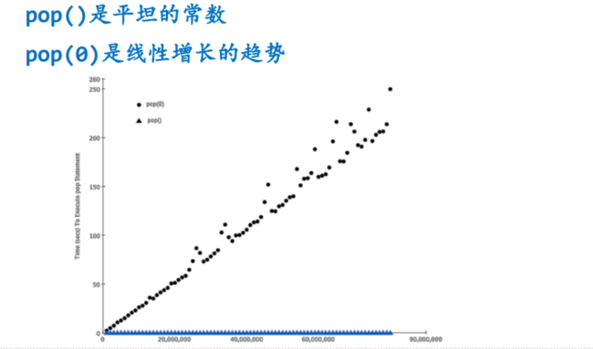
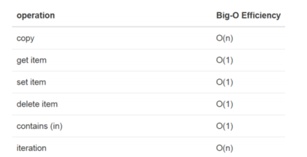
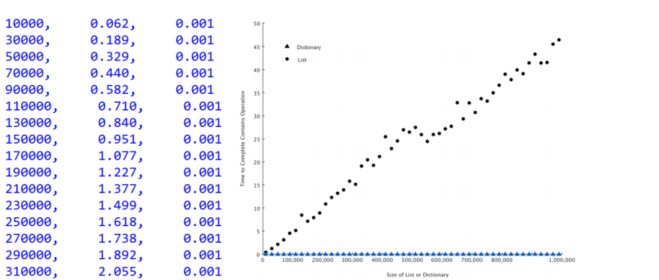

# Python数据类型的性能（下）

## list.pop的计时实验
虽然都是pop操作，但是pop分为：
+ `pop()`从列表末尾移除元素，`O(1)`
+ `pop(i)`从列表中部移除元素`O(n)`

原因在于Python所选择的实现方法

从中部移除元素的话，要把移除元素后面的元素全部向前挪位复制一遍，虽然看起来有些笨拙。  
但是，这种实现方法能够保证列表的按索引取值和赋值操作是`O(1)`

为了验证表中的O数量级，我们创建相同大小的list，分别调用`pop()`和`pop(0)`  
那么我们期望的结果是：`pop()`的时间不随着list大小变化，`pop(0)`的时间随着list变大而变长

```python
import timeit
popzero = timeit.Timer("x.pop(0)", "from __main__ import x")
popend = timeit.Timer("x.pop()", "from __main__ import x")

# x = list(range(2000000))
# print(popzero.timeit(number=1000))
# print(popend.timeit(number=1000))

# 通过改变列表长度来测试两个操作的增长趋势
print("pop(0)  pop()")
for i in range(1000000, 100000001, 1000000):
    x = list(range(i))
    pe = popend.timeit(number=1000)
    x = list(range(i))
    pz = popzero.timeit(number=1000)
    print(f'{pz:15.5f}, {pe:15.5f}')
```
运行结果
```python
pop(0)  pop()
        1.20372,         0.00006
        2.34044,         0.00004
        3.59235,         0.00003
        4.72807,         0.00004
        6.03620,         0.00012
        8.55215,         0.00005
        9.15474,         0.00009
       10.48896,         0.00010
       13.65572,         0.00004
       11.96182,         0.00011
       13.04823,         0.00004
       14.34946,         0.00004
       17.49978,         0.00005
```

将实验数据画成图表，可以看出增长趋势


## dict数据类型
字典与列表不同，它是根据关键码(key)找到数据项，而列表是根据位置（index）。  
最常用的取值`get`和赋值`set`，其性能为`O(1)`  
另一个重要操作`contains(in)`，是判断字典中是否存在某个key，其性能也是`O(1)`



设计一个性能试验来验证list中检索一个值，以及dict中检索一个值的时间对比
```python
import timeit
import random
for i in range(10000, 1000001, 20000):
    t = timeit.Timer(f"random.randrange({i}) in x", "from __main__ import random, x")
    x = list(range(i))
    lst_time = t.timeit(number=1000)
    x = {j:None for j in range(i)}
    d_time = t.timeit(number=1000)

    print(f"{i}, {lst_time:10.3f}, {d_time:10.3f}")
```
运行结果：
```python
10000,      0.044,      0.000
30000,      0.132,      0.000
50000,      0.213,      0.001
70000,      0.313,      0.000
90000,      0.395,      0.000
110000,      0.502,      0.001
130000,      0.587,      0.001
150000,      0.662,      0.001
170000,      0.760,      0.001
190000,      0.922,      0.001
210000,      0.974,      0.001
230000,      1.029,      0.001
250000,      1.162,      0.001
270000,      1.225,      0.001
290000,      1.443,      0.001
310000,      1.507,      0.001
330000,      1.581,      0.001
350000,      1.635,      0.001
```

可见字典的in操作执行时间与规模无关，是常数。  
而列表的执行时间则随着列表规模加大而线性上升  


## 更多Python数据类型操作复杂度
https://wiki.python.org/moin/TimeComplexity