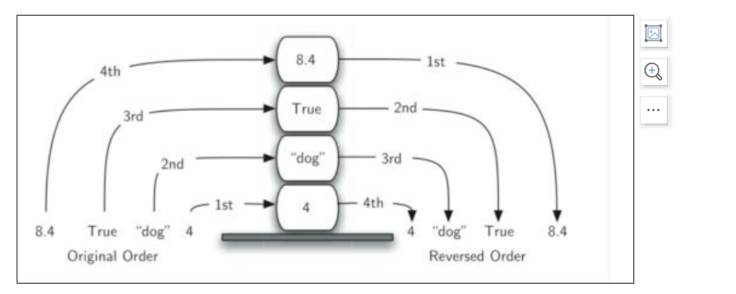
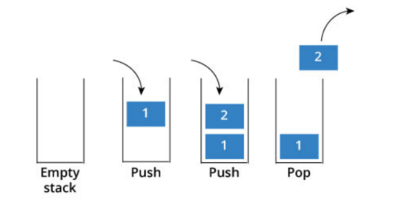
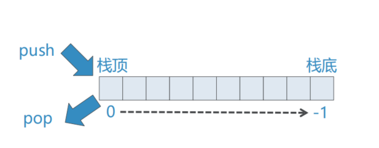
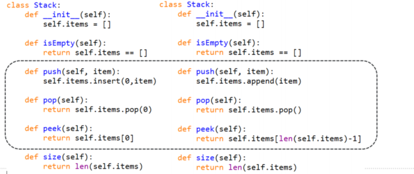

# 栈抽象数据类型及Python实现

## 栈Stack

### 栈是一种有次序的数据项集合，在栈中，数据项的加入和删除都仅能发生在同一端。
这一端就叫做栈顶（top），另一端叫做栈底（base）

### 距离栈底越近的数据项，留在栈中的时间就越长
而最新加入栈的数据会最先被移除
### 这种次序通常称为”后进先出LIFO“

## 栈的特性：反转次序
### 进栈和出栈的次序正好相反


### 这种访问次序反转的特性，我们在某些计算机操作上碰到过
浏览器的“后退back”按钮，最先back的是最近访问的网页

## 抽象数据类型Stack
### 抽象数据类型“栈”是一个有次序的数据集，每个数据项仅从“栈顶”一端加入到数据集中，或从数据集中移除。栈具有后进先出的LIFO的特性


### 抽象数据类型“栈”定义为如下的操作
+ Stack()：创建一个空栈，不包含任何数据项
+ push(item)：将item加入栈顶，无返回值
+ pop()：将栈顶数据项移除，并返回，栈被修改
+ peek()：“窥视”栈顶数据项，返回栈顶的数据项但不移除，栈不被修改
+ isEmpty()：返回栈是否为空栈
+ size()：返回栈中有多少个数据项

## 用Python实现ADT Stack
### 一个细节：Stack的两端对应list设置
可以将List的任意一端（index=0或者-1)设置为栈顶  
我们选择用List的末端(index=-1)来做栈顶
这也就可以使用list的append和pop方法来实现对栈的操作
```python
class Stack:
    def __init__(self):
        self.items = []

    def isEmpty(self):
        # return len(self.items) == 0  # 此处是我自己的实现，相比于老师的来说显得更加复杂
        return self.items == []

    def push(self, item):
        self.items.append(item)

    def pop(self):
        return self.items.pop()

    def peek(self):
        return self.items[len(self.items)-1]
    
    def size(self):
        return len(self.items)
```
## ADT Stack的另一个实现
### 如果我们把List的另一端（首端index=0）作为Stack的栈顶，同样也可以实现Stack


### 不同的方案保持了ADT接口的稳定性
但是性能有所不同，栈顶首端的版本（左边），其push/pop的复杂度为O(n)，而栈顶尾端的实现（右），其push/pop的复杂度为O(1)
