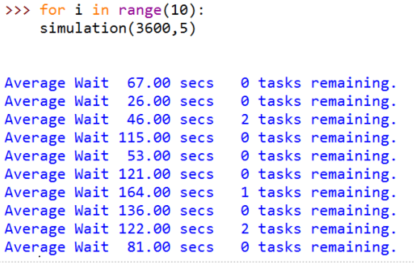

# 队列的应用：打印任务（下）
## 打印任务问题：模拟流程
创建打印队列对象

时间按秒的单位流逝  
+ 按照概率生成打印作业，加入打印队列
+ 如果打印机空闲，且队列不空，则取出队首作业打印，记录此作业等待时间
+ 如果打印机忙，则按照打印速度进行1秒打印，如果当前作业打印完成，则打印机进入空闲

时间用尽，开始统计平均等待时间

作业的等待时间  
生成作业时，记录生成的时间戳
开始打印时，当前时间减去生成时间即可

作业的打印时间  
生成作业时，记录作业的页数  
开始打印时，页数除以打印速度即可

## 打印任务问题：Python代码
```python
import random
from pythonds.basic.queue import Queue

class Printer:
    def __init__(self, ppm):
        # 初始化打印速度、当前任务、以及任务倒计时
        self.print_speed = ppm
        self.current_task = None
        self.countdown = 0

    # 打印当前任务
    def tick(self):
        if self.current_task is not None:
            self.countdown -= 1
            if self.countdown <= 0:
                self.current_task = None

    def is_busy(self):
        if self.current_task is not None:
            return True
        else:
            return False

    def start_next_task(self, new_task):
        self.current_task = new_task
        # 根据打印速度及页数计算所需打印时间
        self.countdown = new_task.get_pages() * 60 / self.print_speed


class Task:
    def __init__(self, time):
        self.create_timestamp = time
        self.pages = random.randrange(1, 21)

    def get_create_time(self):
        return self.create_timestamp

    def get_pages(self):
        return self.pages

    # 根据创建时间以及停止时间计算等待时间
    def get_waiting_time(self, time):
        return time - self.create_timestamp

# 根据1/180的概率生成任务
def create_new_task():
    num = random.randrange(1, 181)
    if num == 180:
        return True
    else:
        return False

def simulate(num_seconds, pages_per_minute):
    task_queue = Queue()
    printer = Printer(pages_per_minute)
    waiting_times = []
    for current_second in range(num_seconds):
        # 创建新任务，入队
        if create_new_task():
            task = Task(current_second)
            task_queue.enqueue(task)
        # 打印机空闲，从队列取任务
        if (not printer.is_busy()) and (not task_queue.isEmpty()):
            next_task = task_queue.dequeue()
            waiting_times.append(next_task.get_waiting_time(current_second))
            printer.start_next_task(next_task)
        printer.tick()

    average_wait = sum(waiting_times)/len(waiting_times)

    print('Average Wait %6.2f secs %3d tasks remaining.' %(average_wait, task_queue.size()))

for i in range(10):
    simulate(3600, 10)
```
## 打印任务问题：运行和分析
按5PPM、1小时的设定

模拟运行10次总平均等待时间93.1秒，最长的平均等待164秒，最短的平均等待26秒  
有3次模拟，还有作业没开始打印


提升打印速度到10PPM、1小时的设定

总平均等待时间12秒，最长的平均等待35秒，最短的平均等待0秒，就是一提交就打印了  
而且，所有作业都打印了


## 打印任务问题：讨论
### 为了对打印模式设置进行决策，我们用模拟程序来评估任务等待时间
通过两种情况模拟仿真结果的分析，我们认识到如果有那么多学生要拿着打印的源代码取上课的话

那么必须牺牲打印质量，提高打印速度。

### 模拟系统对现实的仿真
在不耗费现实资源的情况下——有时候真实的实验是无法进行的

可以以不同的设定，反复多次模拟来帮助我们进行决策

### 打印任务模拟程序还可以加进不同设定，来进行更丰富的模拟
学生数量加倍了会怎么样？

如果在周末，学生不需要赶去上课，能接受更长等待时间，会怎么样？

如果改用Python编程，源代码大大减少，打印的页数减少了，会怎么样？

### 更真实的模拟，来源于对问题的更精细建模，以及以真实数据进行设定和运行
### 也可以扩展到其它类似决策支持问题
如：饭馆的餐桌设置，使得顾客排队时间变短