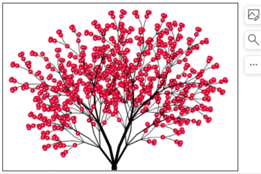

# 递归可视化：分形树
## 递归可视化：图示
### 前面的种种递归算法展现了其简单而强大的一面，但还是难有个直观的概念
### 下面我们通过递归作图来展现递归调用的视觉影象

### Python的海龟作图系统turtle module
Python内置，随时可用，以LOGO语言的创意为基础  
其意象为模拟海龟在沙滩上爬行而留下的足迹  
爬行：forward(n); backward(n)  
转向：left(a); right(a)  
抬笔放笔：penup(); pendown()  
笔属性：pensize(s); pencolor(c)

```python
import turtle
t = turtle.Turtle()

# 作图开始
t.forward(100) # 指挥海龟作图

# 作图结束
turtle.done()
```

```python
# 海龟作图，正方形
import turtle
t = turtle.Turtle()

# 作图开始
for i in range(4):
    t.forward(100)
    t.left(90)

# 作图结束
turtle.done()
```
