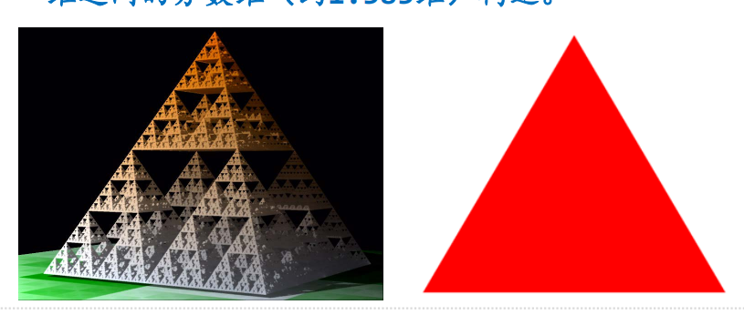
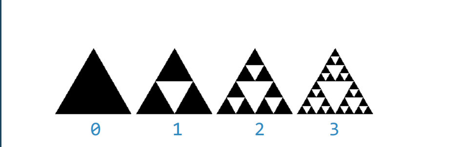
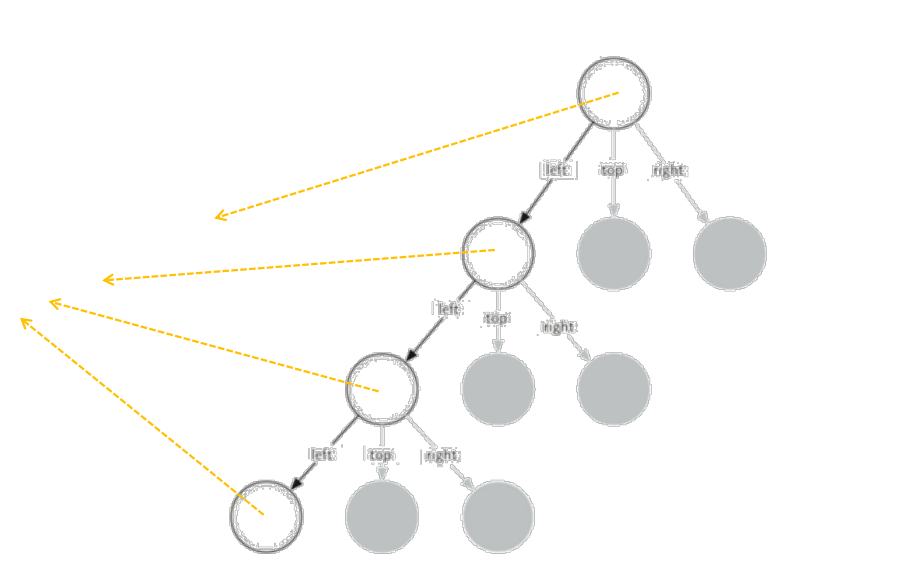

#  递归可视化：谢尔宾斯基三角形
## 谢尔宾斯基三角形
### 分形构造，平面称为谢尔宾斯基三角形，立体称为谢尔宾斯基金字塔
实际上，真正的谢尔宾斯基三角形是完全不可见的，其面积为0，但是周长无穷，
是一个介于一维和二维之间的分数维（约1.585维）构造。

## 谢尔宾斯基三角形：作图思路
### 根据自身相似特性，谢尔宾斯基三角形是由三个尺寸减半的谢尔宾斯基三角形按照品字形拼叠而成
由于我们无法真正做出谢尔宾斯基三角形（degree->无穷），只能做degree有限的近似图形

### 在degree有限的情况下，degree=n的三角形，是由三个degree=n-1的三角形按照品字形拼叠而成
同时，这三个degree=n-1的三角形边长均为degree=n的三角形的一半（规模减小）  
当degree=0，则就是一个等边三角形，这是递归基本结束条件
## 谢尔宾斯基三角形：代码
```python
# 画谢尔宾斯基三角形
import turtle

def sierpinski(degree, points):
    colormap = ['blue', 'red' ,'green', 'white', 'yellow', 'orange']
    # 绘制等边三角形
    drawTriangle(points, colormap[degree])
    # 最小规模0，直接退出
    if degree > 0:
        # 减小规模，get_mid边长减半
        # 调用自身，左上右次序
        sierpinski(degree -1, {
            'left':points['left'],
            'top':get_mid(points['left'], points['top']),
            'right':get_mid(points['left'], points['right'])
        })
        sierpinski(degree -1, {
            'left':get_mid(points['left'], points['top']),
            'top':points['top'],
            'right':get_mid(points['top'], points['right'])
        })
        sierpinski(degree -1, {
            'left':get_mid(points['left'], points['right']),
            'top':get_mid(points['top'], points['right']),
            'right':points['right'],
        })

def drawTriangle(points, color):
    t.fillcolor(color)
    t.penup()
    t.goto(points['top'])
    t.pendown()
    t.begin_fill()
    t.goto(points['left'])
    t.goto(points['right'])
    t.goto(points['top'])
    t.end_fill()


# 获取两个点的中点
def get_mid(p1, p2):
    return ((p1[0] + p2[0]) / 2, (p1[1] + p2[1]) / 2)


t = turtle.Turtle()
# 外轮廓的三个点
points = {
    'left': (-200, -100),
    'top': (0, 200),
    'right': (200, -100)
}
sierpinski(5, points)
turtle.done()


```
## degree=5的三角形

## degree=3的绘制过程
