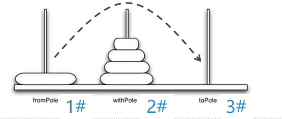

# 递归的应用：汉诺塔
## 复杂递归问题：汉诺塔
### 汉诺塔问题是法国数学家Edouard Lucas于1883年，根据传说提出来的
### 传说在一个印度教寺庙里，有三根柱子，其中一根套着64个由小到大叠放的黄金盘片，僧侣们的任务就是要把这一叠黄金盘片从一根柱子，搬到另一根柱子，但是有两个规则：
+ 一次只能搬一个盘子
+ 大盘子不能叠在小盘子上
### 神的旨意说一旦这些盘子完成迁移
寺庙将会崩塌，世界将会毁灭。。。  
神的旨意是千真万确的！
## 汉诺塔问题
### 虽然这些黄金盘片跟世界末日有着神秘的联系，但是我们不用太过担心，据计算，要搬完这64个盘片：
需要移动的次数为2^64-1=  
18,446,744,073,709,551,615次  
如果每秒钟搬动一次，则需要584,942,417,355（五千亿）年！
### 我们还是从递归三定律来分析汉诺塔问题
基本结束条件（最小规模问题），如何减小规模，调用自身
## 汉诺塔问题：分解为递归形式
### 假设我们有5个盘子，穿在1#柱，需要挪到3#柱
如果能有办法把最上面的一摞4个盘子统统挪到2#柱，那么问题就好解决了：  
把剩下的最大号盘子直接从1#柱挪到3#柱  
再用同样的方法把2#柱上的那4个盘子挪到3#柱，就完成了整个移动

### 接下来的问题是解决将4个盘子如何从1#挪到2#
此时问题规模已经减小！  
同样是想办法将最上面的一摞3个盘子挪到3#柱，把剩下最大号盘子从1#柱挪到2#，再用相同的办法把一摞3个盘子从3#挪到2#
### 一摞3个盘子的挪动也照此：
分为上面一摞2个，和下面最大号的盘子
### 那么两个盘子怎么移动
### 不行，就再分解为一个盘子的移动
## 汉诺塔问题：递归思路
### 将盘片塔从开始柱，经由中间柱，移动到目标柱：
+ 首先将上层N-1个盘片的盘片塔，从**开始柱**，经过**目标柱**，移动到**中间柱**；
+ 然后将第N个（最大的盘片）从**开始柱**，移动到**目标柱**
+ 最后将放置在**中间柱**的N-1个盘片的盘片塔，经由**开始柱**，移动到**目标柱**
### 基本结束条件，也就是最小规模问题：
1个盘片的移动问题
