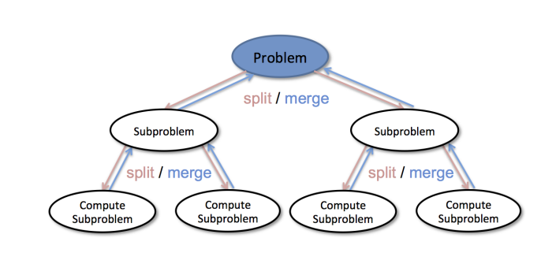

# 分治策略与递归
## 分治策略
### 解决问题的典型策略：分而治之
将问题分为若干更小规模的部分  
通过解决每一个小规模部分问题，并将结果汇总得到原问题的解  

## 递归算法与分治策略
### 递归三定律
基本结束条件，解决最小规模问题  
缩小规模，向着基本结束条件演进  
调用自身来解决已缩小规模的相同问题
### 体现了分而治之
问题解决依赖于若干缩小了规模的问题汇总得到原问题的解
### 应用相当广泛
排序、查找、遍历、求值等等