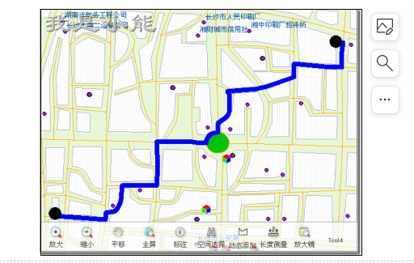
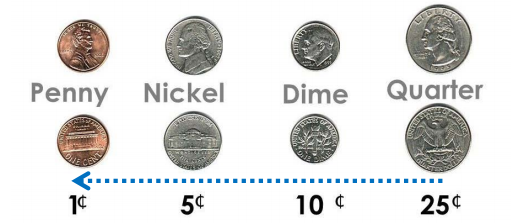
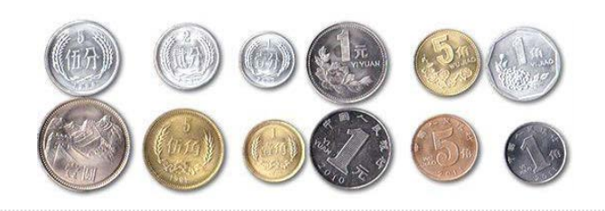

# 优化问题和贪心策略
## 优化问题
### 计算机科学中，许多算法都是为了找到某些问题的最优解
例如，两个点之间的最短路径；  
能最好匹配一系列点的直线；  
或者满足一定条件的最小集合  

## 找零兑换问题
### 一个经典案例就是兑换最少个数硬币的问题
假设你为一个自动售货机厂家编写程序，自动售货机要每次找给顾客最少数量的硬币；  
假设某次用户投入了$1纸币，买了ȼ37的东西，要找零ȼ63，那么最少数量就是：2个quarter（ȼ25）、
一个dime（ȼ10）和3个penny（ȼ1），一共6个

## 贪心策略解决找零兑换问题
### 人们会采用各种各样的策略来解决这些问题，例如最直观的“贪心策略”
### 一般我们这样做：
从最大面值开始，用尽量多数量找零  
之后的余额，再用第二大面值的硬币，也用尽量多的数量找零  
直到最后的penny（ȼ1）为止

## 贪心策略Greedy Method
### 贪心策略
因为我们每次都视图解决问题的**尽量大**的一部分  
对应到兑换硬币问题，就是每次以**最多数量**的**最大面值**硬币来**迅速减少**找零面值
### “贪心策略”解决找零问题时，在美元或者其他货币的硬币体系下表现尚好

## 贪心策略失效
### 但是如果你的老板决定把售货机出口到Elbonia，事情就会有些复杂
（系列漫画Dilbert里杜撰的国家）  
因为这个古怪的国家除了上面3种面值之外，还有一种【ȼ21】的硬币！
### 按照“贪心策略”，在Elbonia，ȼ63还是原来的6个硬币：
ȼ25的2个、ȼ10的1个、ȼ1的3个
### 但是实际上最优解是3个面值ȼ21的硬币
ȼ63 = ȼ21*3
### “贪心策略”失效了
