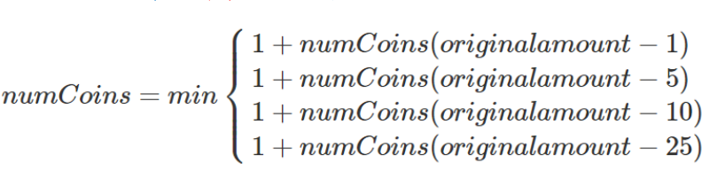
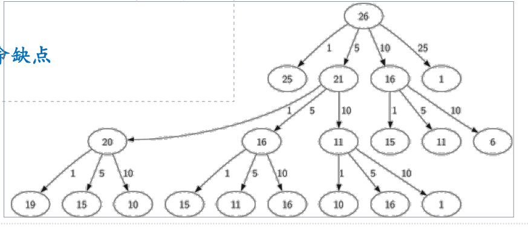

# 找零兑换问题的递归解法
## 找零兑换问题：递归解法
### 我们来找一种肯定能找到最优解的方法
贪心策略是否有效，依赖于具体的硬币体系
### 首先是确定基本结束条件，兑换硬币这个问题最简单直接的情况就是，需要兑换的找零，其面值正好等于某种硬币
比如找零25分，那就直接返回1个硬币即可。
### 其次是减小问题规模，我们要对每种硬币尝试一次，例如美元硬币体系：
找零减去1分(penny)后，求兑换硬币最少数量（递归调用
自身）；  
找零减去5分(nikel)后，求兑换硬币最少数量  
找零减去10分(dime)后，求兑换硬币最少数量  
找零减去25分(quarter)后，求兑换硬币最少数量  
上述4项中选择最小的一个。  

## 找零兑换问题：递归解法代码
```python
def recMC(coinValueList, change):
    # 先初始化mincoins=change，假设全用1块的找零，最多也就change个
    mincoins = change
    # 最小规模问题，如果找零整好等于某一种硬币的面额，那么就直接返回1
    if change in coinValueList:
        return 1
    else:
        # 减小问题规模，将每一种情况都实验完成，选择找零需要的最小硬币数
        for i in [c for c in coinValueList if c < change]:
            numcoins = 1 + recMC(coinValueList, change-i)
            if numcoins < mincoins:
                mincoins = numcoins

    return mincoins

print(recMC([1, 5, 10, 25], 63))
```
## 找零递归问题：递归解法分析
### 递归解法虽然能够解决问题，但是最大的问题是：极！其！低！效！
对于63分钱的硬币兑换问题，需要进行67,716,925次递归调用！  
在我的电脑上耗费了21秒
```python

if __name__ == '__main__':
    t1 = time.process_time()
    print(recMC([1, 5, 10, 25], 63))
    t2 = time.process_time()
    print('time:', t2 - t1)

6
time: 21.140625

```
### 以26分硬币兑换为例，看看递归调用过程（377次递归的一小部分）
我们发现一个重大秘密，就是**重复计算**太多了！  
例如找零15分，就出现了三次！而它最终解决还需要52次递归调用。
很明显，这个算法的知名缺点是重复计算。

## 找零兑换问题：递归解法改进
### 对于递归解法进行改进的关键在于消除重复计算
我们可以用一个表来将**计算过的结果缓存起来**，在计算之前查表看看是否已经计算过
### 这个算法的中间结果就是部分找零的最优解，在递归调用过程中已经得到的最优解被记录下来
在递归调用之前，先查找表中是否已经有**部分找零**的最优解  
如果有，**直接返回**最优解，而不是进行递归调用  
如果没有，才进行递归调用
```python
# https://smartkeyerror.com/dp(01)
# 记忆化搜索
import time
def recMC(coinValueList, change, mem):
    mincoins = change
    if change in coinValueList:
        # 记录最优解
        mem[change] = 1
        return 1
    # 先查表，成功的话直接用最优解
    elif mem[change] >0:
        return mem[change]
    else:
        for i in [c for c in coinValueList if c < change]:
            numcoins = 1 + recMC(coinValueList, change-i, mem)
            if numcoins < mincoins:
                mincoins = numcoins
                # 记录最优解
                mem[change] = mincoins

    return mincoins


t1 = time.process_time()
print(recMC([1, 5, 10, 25], 63, [0]*64))
t2=time.process_time()
print('time:',t2-t1)

```
### 改进算法后，极大地较少了递归调用次数
对于63分兑换硬币问题，仅仅需要221次递归调用，是改进前的三十万分之一，瞬间返回！
```python
6
time: 0.0
```