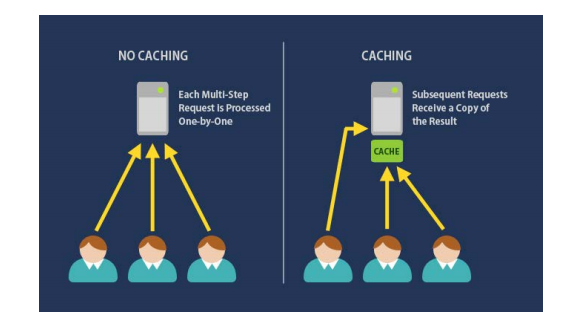
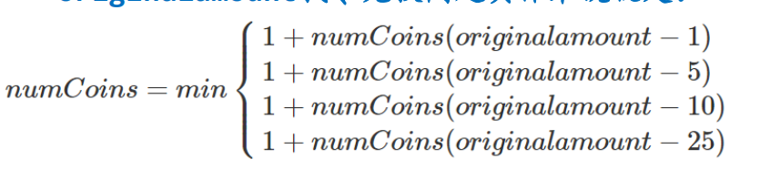
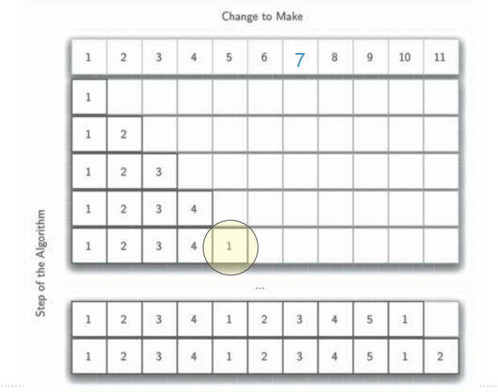
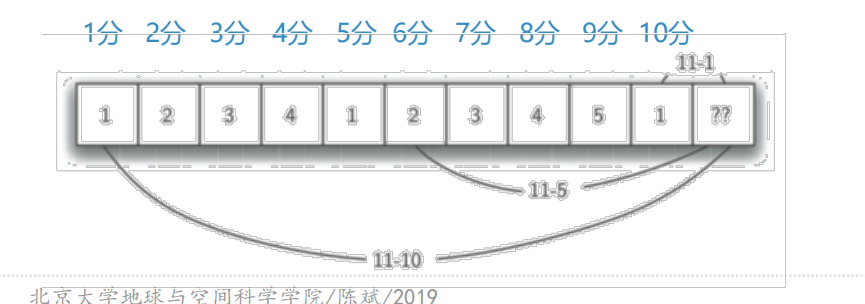

# 找零兑换问题的动态规划解法
## 找零兑换：动态规划解法
+ 中间结果记录可以很好的解决找零兑换问题
+ 实际上，这种方法还不能称之为动态规划，而是叫做“memoization”（记忆化/函数值缓存）的技术提高了递归解法的性能

+ 动态规划算法采用了一种**更有条理**的方式来得到问题的解
+ 找零兑换的动态规划从**最简单**的“1分钱找零”的最优解开始，**逐步递加**上去，直到我们需要的找零钱数
+ 在找零递加过程中，**设法保持每一分钱的递加都是最优解**，一直加到求解找零钱数，自然就得到最优解
+ 递加的过程能保持最优解额度**关键**是，其**依赖于**更少钱数最优解的简单计算，而更少钱数的最优解已经得到了
+ **问题的最优解**包含了**更小规模子问题的最优解**，这是一个最优化问题能够用动态规划策略解决的**必要**条件  
originalamount找零兑换问题具体来说就是：

+ 采用动态规划来解决11分钱的兑换问题  
从一分钱开始，逐步建立一个兑换表

+ 计算11分钱的兑换法，我们做如下几步：  
首先是减去1分硬币，剩下的10分钱查表最优解是1  
然后减去5分硬币，剩下6分钱查表最优解是2  
最后减去10分硬币，剩下一分钱查表最优解是1
+ 通过上述最小值得到最优解：2个硬币

## 找零兑换：动态规划代码
```python

```