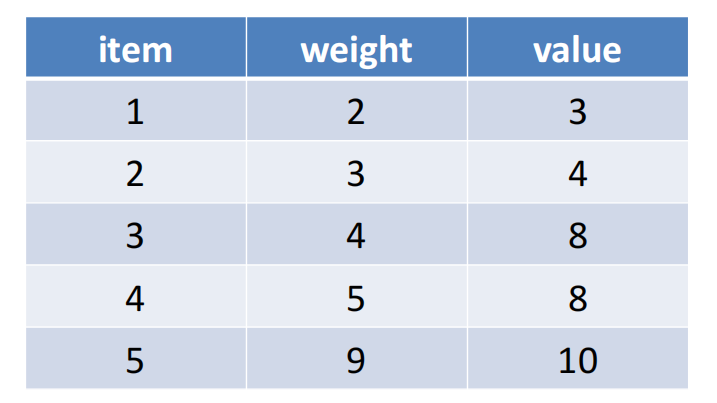
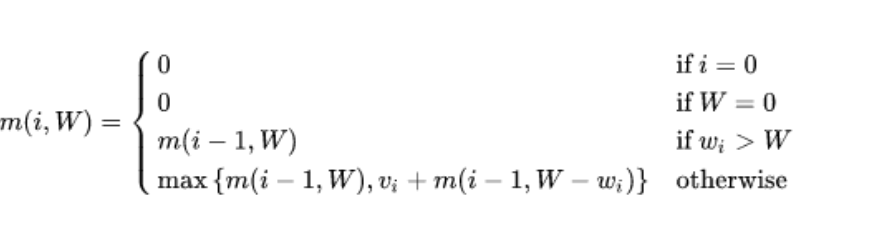
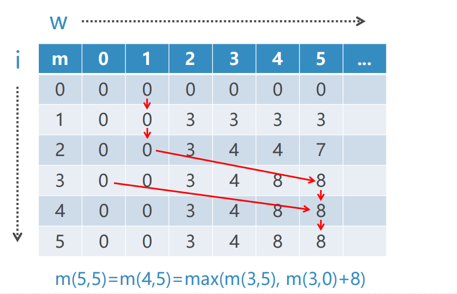

# 动态规划案例分析
## 讨论：博物馆大盗问题
+ 大盗潜入博物馆，面前有5件宝物，分别有重量和价值，大盗的背包仅仅能负重20KG，那么如何选择宝物，使得总价值最高？

+ 我们把m(i,W)记为：  
**前i**(1<=i<=5)个宝物中，组合**不超过**W(1<=W<=20)重量，得到的**最大**价值  
m(i,W)应该是m(i-1,W)和m(i-1, W-Wi)+vi两者的最大值  
我们从m(1,1)开始计算到m(5, 20)  
  
```python
按照我的理解，就是从少到多考虑要装的宝物，当遇到一个新宝贝的时候，如果当前容量不够装，那么之前的结果就是最优结果，
如果够装，那么看看是之前结果大？还是装上他之后再加上剩余的最优结果大
```
## 博物馆大盗问题：动态规划表格

## 博物管大盗问题：动态规划代码
```python
# 动态规划背包问题
# 宝物的重量和价值
tr = [None, {'w': 2, 'v': 3}, {'w': 3, 'v': 4},
      {'w': 4, 'v': 8}, {'w': 5, 'v': 8},
      {'w': 9, 'v': 10}]

# 大盗最大承重
max_w = 20

# 初始化二维表格m[(i,w)]
# 表示前i个宝物中，最大重量w的组合，所得到的最大价值
# 当i什么都不取，或w上限为0，价值均为0
m = {(i, w): 0 for i in range(len(tr)) for w in range(max_w + 1)}

for i in range(1, len(tr)):
    for w in range(1, max_w + 1):
        # 如果装不下第i个物品
        if tr[i]['w'] > w:
            # 不装了
            m[(i, w)] = m[(i - 1, w)]
        else:
            # 装和不装第i个宝物，两种情况的最大价值
            m[(i, w)] = max(m[(i - 1, w)],
                            tr[i]['v'] + m[(i - 1, w - tr[i]['w'])])

# 输出结果
print(m[(len(tr) - 1, max_w)])

```
## 博物管大盗问题：递归解法
```python
# 宝物的重量和价值
tr = {(2, 3), (3, 4), (4, 8), (5, 8), (9, 10)}
# 大盗最大承重
max_w = 20

# 初始化记忆化表格m
# key是(宝物组合， 最大重量）,value是最大价值
m = {}


def thief(tr, w):
    if tr == set() or w == 0:
        m[(tuple(tr), w)] = 0  # tuple是key的要求
        return 0
    elif (tuple(tr), w) in m:
        return m[(tuple(tr), w)]
    else:
        vmax = 0
        for t in tr:
            if t[0] <= w:
                # 逐个从集合中去掉某个宝物，递归调用
                # 选出所有价值中的最大值
                v = thief(tr - {t}, w - t[0]) + t[1]
                vmax = max(vmax, v)
        m[(tuple(tr), w)] = vmax
        return vmax

# 输出结果
print(thief(tr, max_w))

```
## 小结
+ 上面我们分别用动态规划以及递归解决了博物馆大盗问题
+ 由于递归算法简介直观，只要递归和记忆化搜索应用得当，也能高效解决问题
+ 同学们可以把本案例与找零兑换问题的递归和动态规划解法分别对比，找出其中的规律