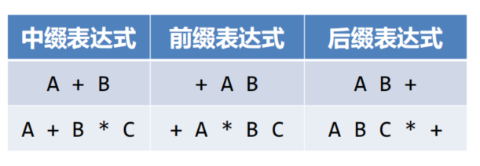
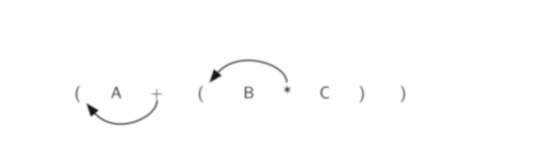
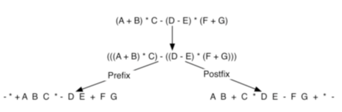

## 中缀表达式
操作符介于操作数中间的表示法，称为中缀表示法。
比如:`A+B*C`  
但是这种方式还需要定义操作符的优先级，来消除混淆。
+ 高优先级的操作符先计算
+ 相同有小鸡的操作符从左到右依次计算

同时引入**括号**来来表示**强制优先级**，括号的优先级最高，在嵌套括号中，内层的优先级更高。  
这样`(A+B)*C`的结果就是A与B之和再乘C

## 全括号中缀表达式
对于计算机来说，最好是能明确规定所有的计算顺序，这样就无需处理复杂的优先规则  
所以引入了**全括号表达式**：在所有的表达式项两边都加上括号
`A+B*C+D`表示为：((A+(B*C))+D)

## 前缀表达式和后缀表达式
对于中缀表达式:`A+B`  
将操作符移动到前面:`+AB`，也就是前缀表示法  
将操作符移动到后面:`AB+`，也就是后缀表示法

按照操作符与操作数的位置来定义：  
前缀表示法：操作符、操作数1、操作数2  
后缀表示法：操作数1、操作数2、操作符

将带有括号的中缀表达式`(A+B)*C`转换为前置表达式，结果为：`*+ABC`，转换为后缀表达式，结果为：`AB+C*`
可以发现，**中缀表达式中的括号不见了**，在前缀和后缀表达式中，**操作符的次序**完全决定了运算的次序，所以不再有混淆。

## 中缀表达式转换为前缀和后缀形式
首先将普通表达式，转换为全括号中缀表达式  
`A+B*C` -> `(A+(B*C)) `  
每一对括号，都包含了一组完整的操作数和操作符

转换为后缀形式：将操作符移动到对应的右括号的位置，删除左括号

转换为前缀形式：将操作符移动到对应的左括号的位置，删除右括号

所以说，无论表达式有多复杂，需要转换成前缀或者后缀形式，只需要两个步骤
+ 将中缀表达式转换为全括号形式
+ 将所有的操作符移动到子表达式所在的左括号（前缀）或右括号（后缀）处，替代之，再删除所有的括号
