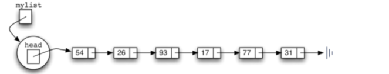
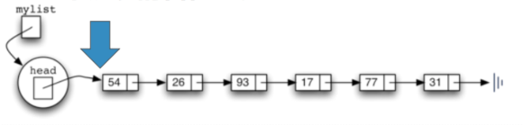
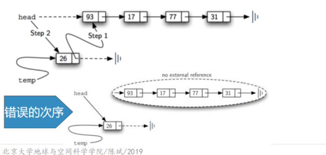
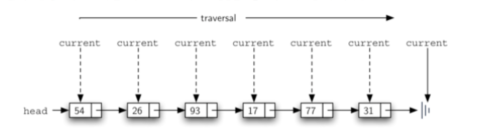
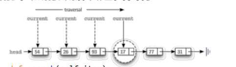
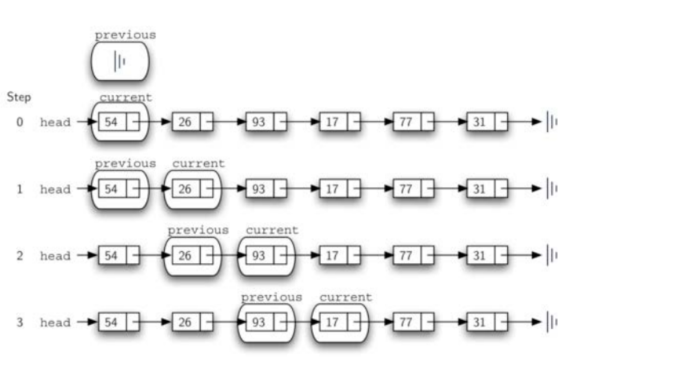
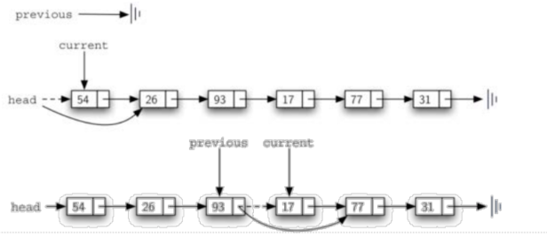

# 无序表的链表实现
## 链表实现：无序表UnorderedList
### 接下来考虑如何实现向无序表中添加数据项，实现add方法
由于无序表并没有限定数据项之间的顺序

所以新数据项可以加入到原表的任何位置

按照实现的性能考虑，应添加到最容易加入的位置

### 由链表结构我们知道
要访问整条链上的所有数据项，都必须从表头head开始沿着next链接逐个向后查找

所以添加新数据项最快捷的位置是**表头**，整个链表的首位置


### add方法
### 按照图片的代码调用，形成的链表应该是以下形式

### 链接的次序很重要
## 链表实现：add方法实现
```python
    def add(self, item):
        temp = Node(item)
        temp.set_next(self.head)
        self.head = temp
```

## 链表实现：size
### size：从链表头head开始遍历到表尾，同时记录用变量累加经过节点个数

```python
    def size(self):
        count = 0
        current = self.head
        while current is not None:
            count +=1
            current = current.get_next()
        return count
```
## 链表实现：search
### 从链表头head开始遍历到表尾，同时判断当前节点的数据项是否目标

```python
    def search(self, item):
        current = self.head
        found = False
        while current is not None and not found:
            if current.get_data() == item:
                found = True
            else:
                current = current.get_next()
        return found
```
## 链表实现：remove(item)方法
### 首先要找到item，这个过程跟search一样，但在删除节点时，需要特别的技巧
current指向的是当前匹配数据项的节点

而删除需要把前一个节点的next指向current的下一个节点

所以我们在search current的同时，还要维护前一个（previous）节点的引用

### 找到item之后，current指向item节点，previous指向前一个节点，开始执行删除，需要区分两种情况：
+ current是首个节点
+ 或者是位于链条中间的节点

## 链表实现：remove(item)代码
```python
    def remove(self, item):
        current = self.head
        previous = None
        found = False
        # 先查找是否存在匹配的数据项
        while not found:
            if current.get_data() == item:
                found = True
            else:
                previous = current
                current = current.get_next()
        # 再根据是否是表头分别进行处理
        if previous is None:
            self.head = current.get_next()
        else:
            previous.set_next(current.get_next())
```