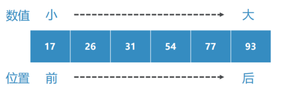
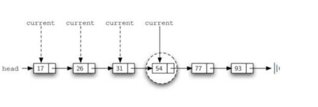
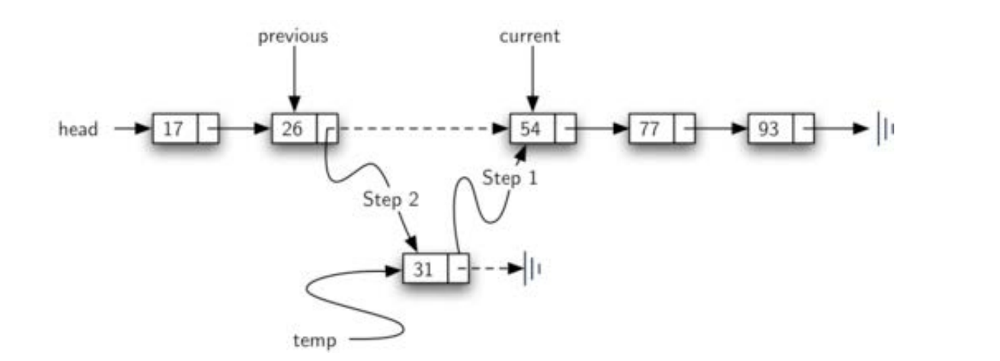

# 有序表抽象数据类型及Python实现
## 抽象数据类型：有序表OrderedList
### 有序表是一种数据项依照其某一种可比性质（如整数大小、字母表先后）来决定在列表中的位置
### 越“小”的数据项越靠近列表的头，越靠“前”

### OrderedList所定义的操作如下：
+ OrderedList():创建一个空的有序表
+ add(item):在表中添加一个数据项，并保持整体顺序，此项原来不存在
+ remove(item):从有序表中移除一个数据项，此项应该存在，有序表被修改
+ search(item):在有序表中查找数据项，返回是否存在
+ isEmpty()：是否空表
+ size()：返回表中数据项的个数
+ index(item)：返回数据项在表中的位置，此项应存在
+ pop()：移除并返回有序表中最后一项，表中应至少存在一项
+ pop(pos)：移除并返回有序表中指定位置的数据项，此位置应存在
### 在实现有序表的时候，需要记住的是，数据项的相对位置，取决于它们之间的“大小”比较
由于Python的扩展性，下面对数据项的讨论并不仅仅适用于整数，可以适用于所有定义了`__gt__`方法（即'>'操作符）的数据类型
### 以整数数据项为例，(17, 26, 31, 54, 77, 93)的链表形式如图

### 同样使用链表方式实现
### Node的定义相同
### OrderedList也设置一个head来保存链表表头的引用
```python
class OrderedList:
    def __init__(self):
        self.head = None
```
### 对于isEmpty/size/remove这些方法，与节点的次序无关 ，所以其实现跟UnorderedList是一样的。
### search/add方法需要修改

## 有序表实现：search方法
### 在无序表的查找过程中，如果查找的数据项不存在，那么需要搜索整个链表，直到表尾
### 对于有序表来说，可以根据链表节点是有序的特性，来节省不存在的数据项的查找时间
一旦确定某一个节点的数据项大于要查找的数据项，则说明后面已经不可能有要查找的数据项了，可以直接返回False
### 如我们要在下图查找数据项45

```python
    def search(self, item):
        current = self.head
        found = False
        is_over = False
        while current is not None and not found and not is_over:
            if current.get_data() == item:
                found = True
            else:
                if current.get_data() > item:
                    is_over = True
                else:
                    current = current.get_next()
        return found
```
## 有序表实现：add方法
### 相比无序表，改动最大的就是add方法，因为add方法必须保证加入的数据项添加到合适的位置，来维护整个链表的有序性。
比如在(17,26,54,77,93)有序表中添加元素31，那么我们就需要沿着链表，找到第一个大于31的数据项，
也就是54，将31插入到它前面

### 由于涉及到的插入位置是当前节点之前，而链表没有对前一个节点的引用
### 所以，和remove方法类似，引入一个previous来记录上一个节点，current记录当前节点
### 一旦找到了第一个比31大的数据项，previous就发挥作用了
```python
    def add(self, item):
        current: Node = self.head
        previous: Node = None
        found_larger: bool = False
        while current is not None and not found_larger:
            if current.get_data() > item:
                found_larger = True
            else:
                previous = current
                current = current.get_next()
        temp = Node(item)
        if previous is None:
            temp.set_next(current)
            self.head = temp
        else:
            previous.set_next(temp)
            temp.set_next(current)
```
## 链表实现有序表的算法分析
### 对于链表复杂度的分析，主要是看对应的方法是否涉及到链表的遍历
### 对于一个包含节点数为你的链表
isEmpty()的时间复杂度是`O(1)`，因为只需要判断self.head是否为None即可

size是`O(n)`，因为除了遍历到表尾，没有其它办法得知节点的数量

search/remove以及有序表的add方法则是`O(n)`因为它们都需要遍历链表，但是按照概率来说，其平均操作次数为n/2

而无序表的add方法则是`O(1)`，因为只需要往头结点插入即可，不涉及遍历

### 链表实现的List，跟Python内置的列表数据类型，在有些相同方法的实现上的时间复杂度不同
### 主要是因为Python内置的列表数据类型是基于顺序存储来实现的，并进行了部分优化
